# S3 DataStage Flow

## Table of Contents

- [1.Pre-requisite](#1-pre-requisite)
    - [1.1 Create a S3 bucket](#11-create-a-s3-bucket)
    - [1.2 Create a Watson Project](#12-create-a-watson-project)
- [2. Create a S3 connection](#2-create-a-s3-connection)
- [3. Create a DataStage project](#3-create-a-datastage-project)
- [4. Create S3 flow](#4-create-s3-flow)
    - [4.1 Configure the Flow](#41-configure-the-flow)
- [5. Run & Verify Flow](#5-run--verify-flow)

## 1. Pre-requisite

### 1.1 Create a S3 bucket

1. Before staring this tutorial, you need a S3 bucket in AWS cloud. Please follow the procedure to create a new bucket using this [link](https://docs.aws.amazon.com/AmazonS3/latest/userguide/creating-bucket.html).

1. Upload a .csv file that we want to use for ETL. We have included a .csv in this repository.

1. To access the S3 bucket, you can make use of Cyberduck. With the access key secret, and bucket name you can access the S3. to download this took please visit -> https://cyberduck.io/download/

    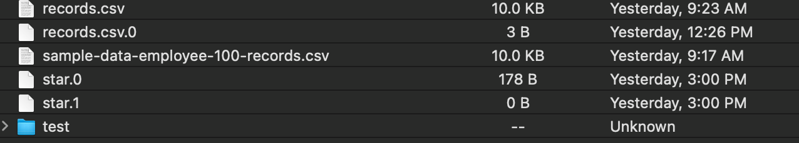

### 1.2 Create a Watson Project

1. Create a new Watson Project/ use an existing one.

1. Navigate to `Projects` --> `All projects` tab from the left pane of Cloud Pak for Data console. And click `New project +` to create new project. Select, create an empty project.

## 2. Create a S3 connection 

1. Open your Watson Studio project, navigate to `Asset` tab. Then click on `New asset +`.

1. Select `Data access tools`, then click on `Connection`.
    

    

1. Select `Third-party` then search for `Amazon S3`, select it.

1. Give name to new S3 connection as shown in screenshot and provide the details to create the connection.
    

    

1. Now test the connection by clicking on `Test connection`. If it is sucessful, you are ready to create new connection. Click on `Create`

## 3. Create a DataStage Flow

1. Navigate to `Asset` tab from your project. Then click on `New asset +`.

1. Scroll down to "Graphical Builders" in the left menu and choose `DataStage Flow` for the new asset.

1. Name your asset, and optionally provide a description.
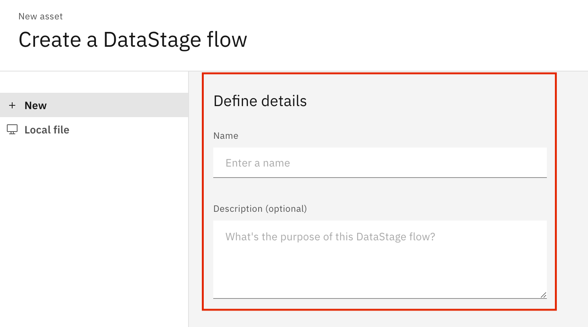

## 4. Building S3 flow

In this flow, we are going to read a .csv file from a S3 bucket, we will filter some rows and then save the new filtered file in same S3 bucket with new filename.

1. Open up the DataStage asset that you just created.

1. Add an S3 Connector for your input data. For this, from left pane click on `Connectors` -> select `Amazon S3`.

    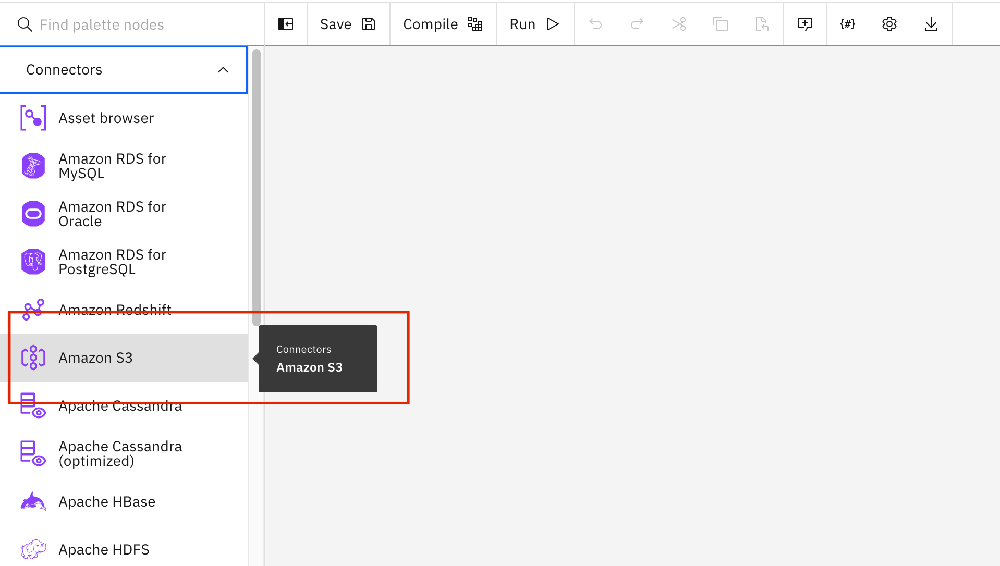

1. Add a second S3 Connector for the final output by following same process.
   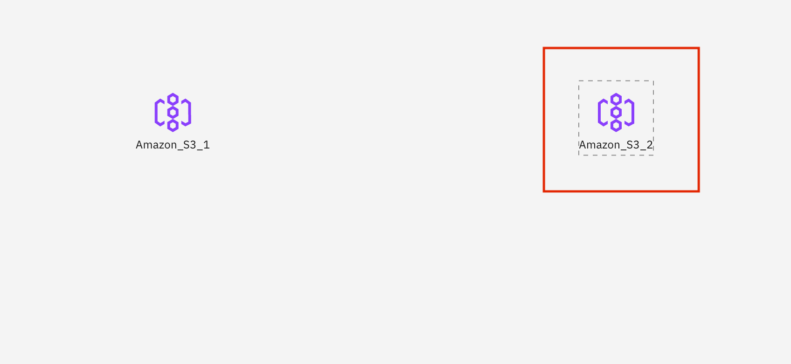

1. Now, add a `filter` step in between these two ends of the flow. Select `Stages` from left pane, and select `Filter`. Drag and drop filter to the canvas.
    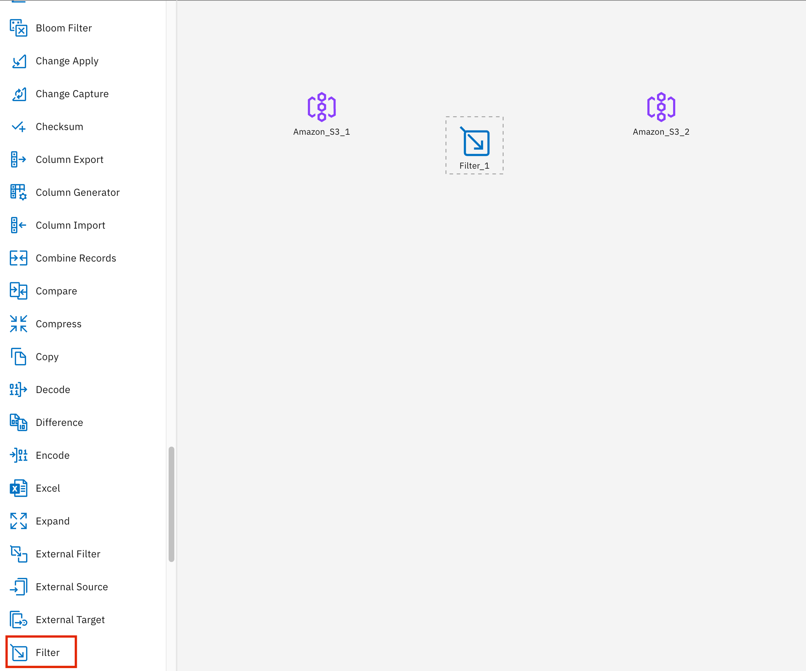

1. Link up your pipeline. First, hover over `Amazon_S3_1` and drag the arrow that shows up to the right of it until it is linked with `Filter_1`. 
   

1. Then do the same between `Filter_1` and `Amazon_S3_2`.
   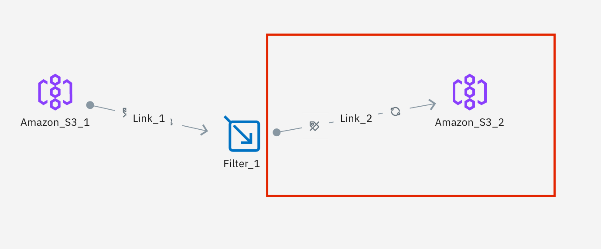

1. Your overall flow should now look like this:
   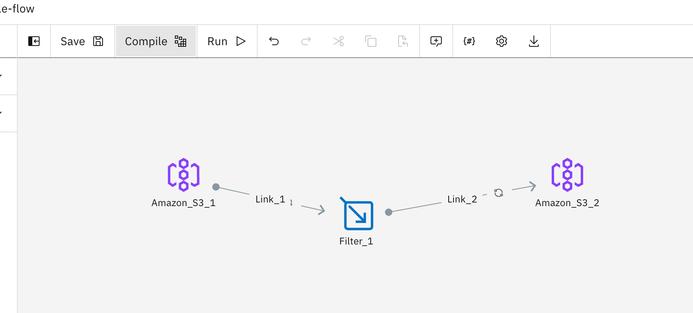

### 4.1 Configure the Flow

Now it's time to edit the settings for each step of the flow. These settings make sure you are connected to the correct data instances, and allow you to customize transformations, choose columns to be passed along, name inputs/outputs, and even customize advanced processing settings when needed for ETL optimization. 

1. Double click on first S3 connector i.e. `Amazon_S3_1`, this will act as a Source.

1. In `Properties` tab from `Stage`,  select the S3 connection you added to your project when you set it up from drop-down menu.

1. Check `Use DataStage1 properties.`. Add bucket name, and file name. We have added `records.csv` file here.

    

1. On `Output` tab, click on `column`, click on `Edit` to import the columns.
    

1. You can preview the data by right clicking on `Amazon_S3_1` select `Preview` option.

1. Save.

1. Now, edit the Filter, double click on `Filter_1`

1. In the `Stage` section, under properties, we can `edit` the `where clause` to filter out the rows of .csv file. 

   

1. Click on `Edit` to add where clause. Please add `country="Spain" OR country="New Zealand"`. 
> Note : This functions the same way as a SQL WHERE clause. Here we choose to only retain records which have a `country` value of "Spain" or "New Zealand"
    

1. We can also edit our Output or Input columns to mimic the "SELECT ___ FROM" behavior of SQL. For this example, we delete the `address` column, and apply an alias of "email_address" to what was originally the `email` column.
    
    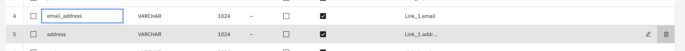

1. Apply and return, then save changes.

1. Lastly, we need to set up our Output S3 node. 

1. Double click on `Amazon_S3_2`, in properties section select the added S3 connection from the drop down menu.
    
1. Add the name of output file. 

    

1. You can check the columns in `Input` section.

    

1. After review, you can save the target S3 connector.

## 5. Run & Verify Flow

1. Save the flow, by clicking on `Save` from the top bar.

1. Compile the DataStage job by clicking on `Compile`. If any steps were missed, you can check the error log to find what went wrong and correct it. 
    

1. After successful compilation, `Run` the DataStage job. Again, if some of the job setup is incomplete you will see a `Failure` message, and you can check the error log to correct the issue. 

1.  Once the job has been successfully run, check your connected S3 database to confirm that your output is there, and as expected. Below, we can see S3 filesystem in Cyberduck after running the job from this tutorial.

    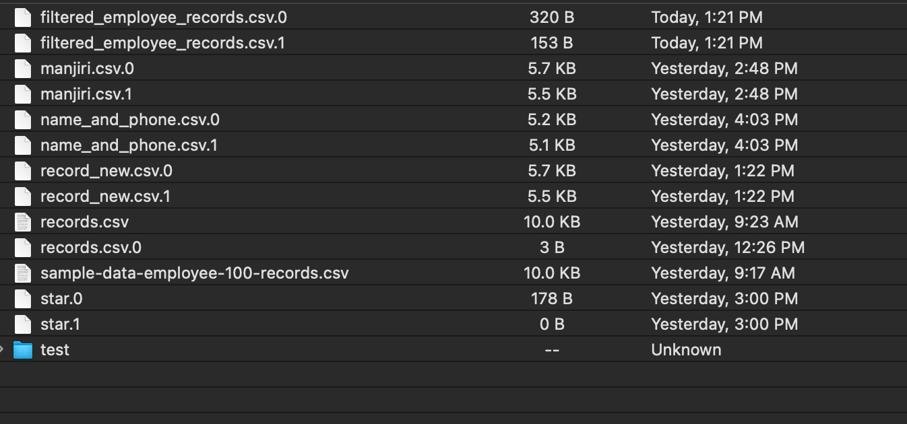

   > Notice that the `filtered_employee_records` are now there. We got two batches for our output, which occurs because of some of the default DataStage advanced settings. Filenames are indexed in such a way that it is easy to recombine them altogether if needed. Batching improves throughput performance. 

1. Looking at each of the two output files, `filtered_employee_records.csv.0` and `filtered_employee_records.csv.1`, we see that our column and row-value filtering performed as expected. Only records with country values of "Spain" or "New Zealand" are retained, and home addresses are dropped. 

    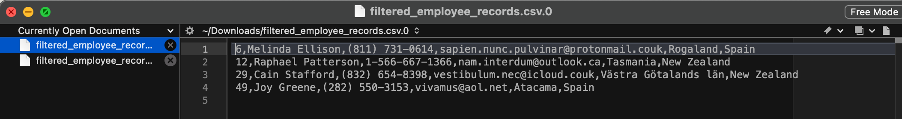
    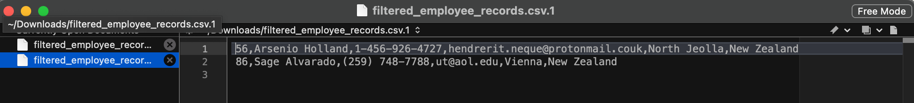
