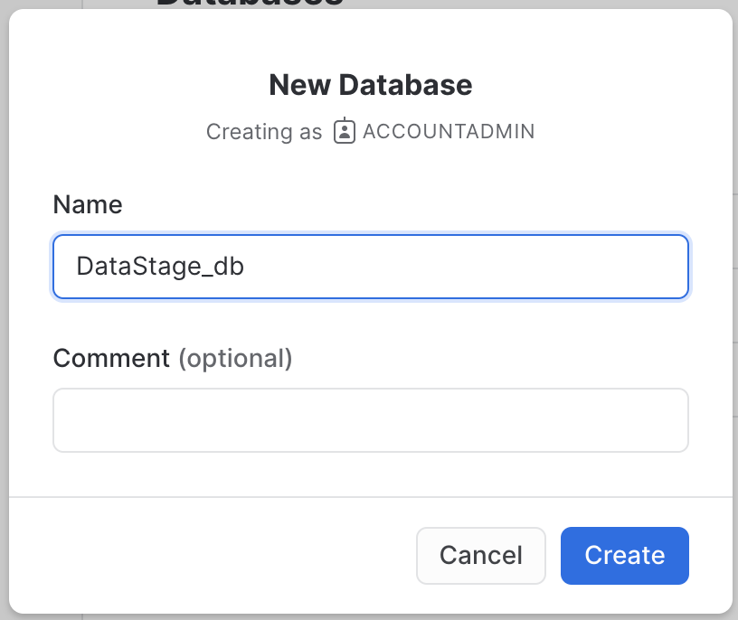
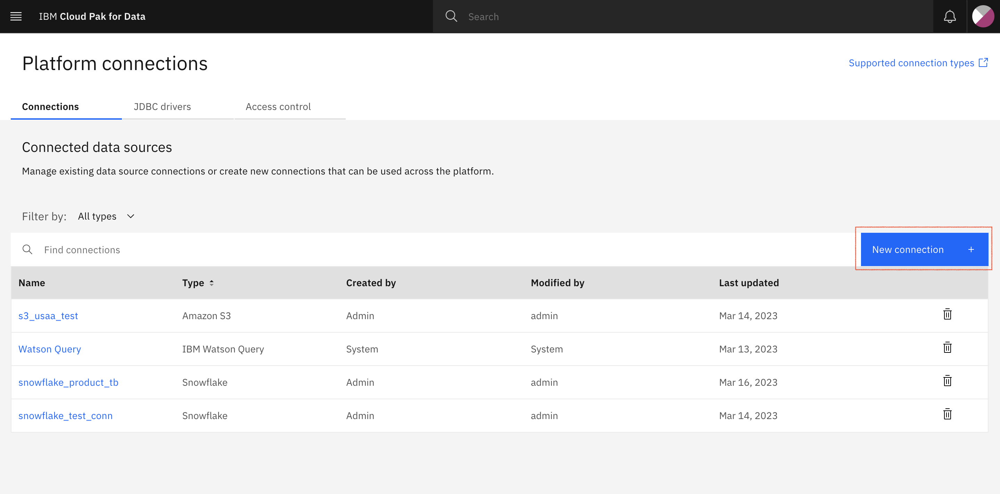

# Snowflake DataStage Flow

## Table of Contents

  - [1. Create a Snowflake Account](#1-create-a-snowflake-account)
  - [2. Create a Table in Snowflake](#2-create-a-table-in-snowflake)
  - [3. Create a Platform Connection in IBM Cloud Pak For Data](#3-create-a-platform-connection-in-ibm-cloud-pak-for-data)
  - [4. Import connection to Watson Studio Project](#4-import-connection-to-watson-studio-project)
  - [5. Create a DataFlow](#5-create-a-dataflow)
    - [5.1 Create a DataStage Project](#51-create-a-datastage-project)
    - [5.2 Create a DataStage Flow using Snowflake connectors](#52-create-a-datastage-flow-using-snowflake-connectors)
    - [5.3 Configure DataFlow](#53-configure-dataflow)
        - [5.3.1 Edit the source connector](#531-edit-the-source-connector)
        - [5.3.2 Edit the Filter connector](#532-edit-the-filter-connector)
        - [5.3.3 Edit the Target connector](#533-edit-the-target-connector)
- [6. Run and Verify ](#6-run-and-verify)


## 1. Create a Snowflake Account

- Create a Snowflake Free Tier account from [this](https://www.snowflake.com/en/) link.
- Fill out the information as shown in screenshot below. (Information filled out in below image is fake).

    

    Click Continue.

     

    Click on Get Started.

- Once the information is filled out the account team will send verification email to you. Accept it, then they will grant you the Snowflake account along with credentials to access it. 

> NOTE: The account is free only for 30 days. After that it will start incurring the money.

- Login to account using the link Snowflake will send you. It looks similar to this - https://oXXXXXX-XXXXX64.snowflakecomputing.com

> Note: From the provided account link i.e. https://oXXXXXX-XXXXX64.snowflakecomputing.com first portion of the link i.e. `oXXXXXX-XXXXX64` is your account name. You need this information further in this exercise.

- After clicking on the link, it will ask you to enter the Username and Password

    

- Below is the screenshot of Snowflake Dashboard

    

## 2. Create a Table in Snowflake

1. Navigate to `Data` tab on Left panel from Snowflake Dashboard Select `Database` . Click on `+Database` to add new database.

    

1. Give name to the Database and click `Create`.  
    

1. Below image shows created database. It has created two schemas 1)Information_schema 2)Public schema. We can create new Schema if we want by clicking on `+ Schema` button. For this tutorial we will use `PUBLIC` schema.
    

1. Add Table to the Schema. Navigate to the required schema. Click on `Create` -> `Table` -> `Standard`.

    

1. Add table definition to the editor and click on `Create Table`.

    Sample Table creation sql statement:
    ```
    create or replace TABLE DATASTAGE_DB.PUBLIC.CUSTOMER (
	CUST_ID NUMBER(38,0),
	CUSTNAME VARCHAR(256),
	CITY VARCHAR(256),
	STATE VARCHAR(256),
	COUNTRY_CODE VARCHAR(256),
	POSTAL_CODE VARCHAR(256),
	EMAIL_ADDRESS VARCHAR(256),
	PHONE_NUMBER VARCHAR(256),
	YTD_SALES VARCHAR(256),
	SALESREP_ID VARCHAR(256),
	NATIONALITY VARCHAR(256),
	NATIONAL_ID VARCHAR(256),
	CREDITCARD_NUMBER NUMBER(38,0),
	CREDITCARD_TYPE VARCHAR(256),
	CREDITCARD_EXP VARCHAR(256),
	CREDITCARD_CVV NUMBER(10,0)
    );
    ```

    More on how to write `create` statement please visit [here](https://docs.snowflake.com/en/sql-reference/sql/create-table)

1. After adding the table definition, click on highlighted button to run SQL statement.
    

1. Now, to add some rows, open the editor by clicking on highlighted button.
    

1. Add SQL statement to insert into table. 

    Sample sql insert statement:

    ```
    INSERT INTO DATASTAGE_DB.PUBLIC.CUSTOMER VALUES (10001,'Micheal Golden','Abbadia Alpina','TO','IT',10060,'Michael.E.golden@spambob.com','724-454-8453',90.3,'SE133','IT','152-374-114',5668369040063070,'American Express','10-24',4950);

    INSERT INTO DATASTAGE_DB.PUBLIC.CUSTOMER VALUES (10002,'Renee Mullins','Columbus','OH','US',45101,'Rene.K.mullins@dodgeit.com','229-990-2162',0,'NC169','UK','124-168-918',5148585346736100,'American Express','10-24',6951);
    
    ```
    
    >Note: Here, we have added to `DATASTAGE_DB`, but you can change the database name.
    > Please add more rows if needed, you can refer to [Customers.csv](data/Customers.csv) file.

    More on how to write `insert` statement please visit [here](https://docs.snowflake.com/en/sql-reference/sql/insert)

1. Copy, paste these to editor, and then click on Run All.
    

1. Preview the added table in your schema. Click on your created table, then click on `Data Preview` tab.
    

## 3. Create a Platform Connection in IBM Cloud Pak For Data

1. From cp4d web-console, navigate to Platform Connections.
    

1. Click on `New Connection` to add new Snowflake connection 
    

1. Once you click that, please select `Third party` then Search for Snowflake and enter `Select`.
    

1. Get the required information i.e Account name, database name, role, etc. to fill out the form from Snowflake Account. 

1. You can get the `account name` from the account URL (alpha numeric phrase before .snowflakecomputing.com).e.g. If your account link is - "https://oXXXXXX-XXXXX64.snowflakecomputing.com" first portion of the link i.e. `oXXXXXX-XXXXX64` is your `account name`.

1. You may find the `Warehouse name` information from Snowflake Dashboard. Navigate to `Admin` -> `Warehouses` -> Check the table for Warehouse name.
    

1. Fill out the information as shown in screenshots. And click `Test Connection` to test the connection.

    
    

1. Once the connection is tested successfully, click `Create`.
    

1. You can check the added connection in Platform Connections.
    

## 4. Import connection to Watson Studio Project

1. From cp4d web console, navigate to `Projects` -> `All Projects`. Create a new Watson Studio Project or use the existing one. For this tutorial we will use existing project. When you enter the project, click on `New asset +` to add the Snowflake platform connector that we just added to Platform connection.
    

1. Here, we have selected `dataflow_mk` project. Enter into the project.

1. From `Assets` tab add `New asset`.
    

1. Click on `Data access tools` -> `Connection` 
    

1. `From Platform` tab, select the recently added snowflake connection. 
    

1. Test the connection again and then create.
    

## 5. Create A DataFlow

### 5.1 Create a DataStage Project

1. From your project, add new asset by clicking on `New Asset +`. Select, `DataStage` this time from `Graphical builders`.

    

1. Give preferred name to the DataStage Project, here we have used `Snowflake_customer_tb_flow`. And create.
   

### 5.2 Create a DataStage Flow using Snowflake connectors

We will be creating a simple flow. We will use `CUSTOMER` table form `DATASTAGE_DB` database, `PUBLIC` schema as our source. And we will create a new transformed table `CUSTOMER_2` using a filter in same database in Snowflake.

1. In the DataStage project, you can see two drop down sections, one for connectors, and one for Stages.
    

1. In the created DataStage project, from `Connectors` on the left pane, search for `Snowflake` connectors.

1. Drag and drop `Snowflake` connector to the space two times.
    

1. from `Stages` section on left pane, drag and drop `Filter` for transformation.
    

1. Make the connection using `Link` among all the components. For this, you just need to drag your cursor from one component to other.
    

1. Rename the Snowflake connectors as `Snowflake_source` and `Snowflake_target` by clicking on pencil button.
    

### 5.3 Configure DataFlow

#### 5.3.1 Edit the source connector

1. Double click on `Snowflake_source` to edit the information.

1. On `Stage tab`, click on added connection from drop down list. 
    

1. From `Output` tab. Click on `Usage`. Select `Use DataStage properties`. Then write the table name you want to fetch data from. You need to provide table name as "SCHEMA_NAME.TABBLE_NAME". Click on `Generate SQL at run time`.
    

1. Moving on to `Columns` section in `Output` tab, please click on `Edit` to add the columns from the SnowFlake table.
    

1. Click on Import from table to import the columns.
    

1. Select the table from connection. And click `Next`.
    

1. Select / unselect the columns, and then click on `Import`. Then do `Apply and Return`.
    

1. Preview the imported columns in the source side. and then click on `Save` button.
    

1. You can preview the added data by right clicking on Source connector, then clicking on `Preview` option.
    


#### 5.3.2 Edit the Filter connector

1. We will use `Filter` to filter out the rows before coping `CUSTOMER` table to new table for this tutorial.

1. Double click on filter `Filter_1` to edit it's properties.
    

1. On `Stages` tab, click on `Edit` to add where clause. We will filter the data based on state column. Click Apply and return, and then save it.

    

#### 5.3.3 Edit the Target connector

1. Double click on `Snowflake_target` connector.

1. In `Stage` tab select the connection from drop down list.
    

1. Now, in `Input` tab under `Usage`, uncheck `Use DataStage properties`. In write mode we have selected `Merge`. Declare the name of Schema and choice of Table name. We are going to create table in `PUBLIC` schema. And select Table action as `Append`.

    

1. In column section, check if you can see all the columns. If you want to edit the columns please do so. Here, we are not going to change anything. Click `Save`.
    

### 6. Run and Verify

1. On the top bar, you can see `Compile`, `Run` options. Please view the flow. Click on `Compile` to compile the flow.
    

1. After successful compilation, click on `Run` to run it.

1. Check the logs, and success message.
    

1. Verify if the transformed table in Snowflake.You can see, that new table has the row having State `OH`.

    