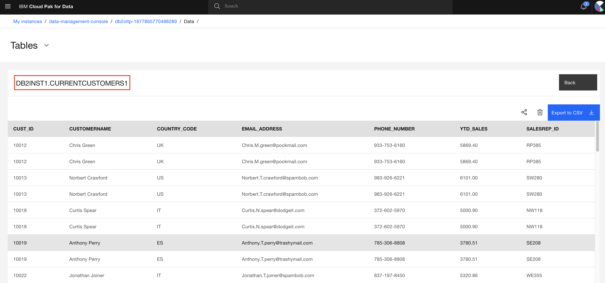

## Exercise 1. Create a DataStage Flow (DB2 to DB2)

In this exercise, you will:

- Create a project.
- Provision the DataStage service.
- Add a data set to your project from the Gallery.
- Create a DataStage flow.
- Run your DataStage flow and view your asset.

It takes approximately 20 minutes to complete.

### Step 1.1: Create a project

1. Login to CP4D console.

    

1. From the navigation menu, click `Projects` > `All projects`. Projects page appears.
1. To create a new project, select `New project +`. Optionally, you may use an existing project.
1. Select `Create an empty project` option.
1. On the New project screen, enter `ds-tutorial` as the project name and enter optional description for the project.
1. `Create`.

You successfully created a new Watson Studio project.

### Step 1.2: Collect database credential

1. Open a new tab in your browser.
1. Login to CP4D console.
1. From the navigation menu, click `Data` > `Databases`. Database page appears.
1. Click the 3 vertical dots of your database and select `Details`.

    

1. Collect the following information.
    - Database name
    - Hostname
    - Port

### Step 1.3: Add the Db2 connection to your project

1. Open your `ds-tutorial` project if it's not open.
1. Navigate to the `Assets` tab.
1. Click `New Asset +`.

    

1. Select `Connection` from the asset type list.

    

1. In the left pane, select `IBM` under the `Provider` section. This greatly reduces the data sources displayed in the right pane.
1. Select/highlight `IBM Db2` in the right pane. 
1. `Select`.
1. Name the connection as `Db2`.
1. Enter the following information that you have collected in the previous section.
    - Database
    - Hostname or IP address
    - Port
    - Input method (`Enter credential manually` is selected by default)
    - Username (pre-populated, keep the default value)
    - Password (pre-populated, keep the default value)

    

1. Select the `Test connection` button to validate the connection.
1. Upon the successful validation, you should receive the message `The test was successful.`
1. `Create`.

You successfully created and added a Db2 connection to your project.

### Step 1.4: Create a DataStage Flow

1. Open your `ds-tutorial` project if it's not open.
1. Navigate to the `Assets` tab.
1. Click `New Asset +`.

    

1. In the left pane, select `Graphical builders` to filter the available services.
1. Select `DataStage` in the right pane.
1. Enter `Flow-For-DB2` as the name of the DataStage flow and an optional description.
1. `Create`.

You successfully created and added a DataStage flow to your project.

### Step 1.5: Design the flow

1. Expand the `Connectors` in the left pane.

    

1. Drag and drop the `Asset browser` node onto the canvas.
1. Select `Connection` -> `DB2` -> `"DB2INST1" (or your schema)` -> `CurrentCustomers`.
1. `Add`. 

    > Note: `DB2INST1` is the schema name you selected to upload the Customers.csv file earlier. Your schema name can be different.

    

1. In the Node palette of the left pane, expand the `Stages` section.
1. Drag and drop the `Filter` node to the canvas.
    
    > Note: You can also use the Filter in the “Find palette nodes” search box to find connectors and stages faster.

1. To connect the nodes together, click on the blue arrow on the `CURRENTCUSTOMERS_1` node and drag it to the `Filter_1` node.

    

1. In the Node palette of the left pane, expand the `Stages` section.
1. Drag and drop the `Sort` node to the canvas.
1. Connect the `Filter_1` node to the `Sort_1` node.
1. In the Node palette of the left pane, expand the `Connectors` section.
1. Drag and drop the `Asset browser` node on the canvas.
1. Select `Connection` -> `DB2` -> `DB2INST1` > `CurrentCustomers`.
1. `Add`. 

    >Note: You will change the table name later.

1. Connect the `Sort_1` node to the `Currentcustomers_2` node.

    

### Step 1.6: Edit nodes

To edit the first `Asset browser` node,

1. Double-click the first `Currentcustomers_1` node.
1. In the Properties panel on the right, rename the node from  `CURRENTCUSTOMERS_1` to `CustomerTable`.

    

1. `Save`.

To edit the `Filter_1` node,

1. Double-click the `Filter_1` node.
1. In the Properties panel, rename the text `Filter_1` to `Filter_YTD_Sales`.
1. Expand the Properties section of the Properties panel. 
1. Under Predicates, click Edit.
1. Click the pencil icon under the `Where clause` column to enter editing mode.
1. Enter `YTD_SALES > 1000`.

    

1. Select `Apply and return`.
1. Select the `Output` tab of the Properties panel.

    

1. Expand the `Columns` section.
1. Select `Edit`. This launches the column metadata tearsheet experience.
1. Select ALL the columns.
1. Deselect the following columns.

    - CUST_ID
    - CUSTNAME
    - COUNTRY_CODE
    - EMAIL_ADDRESS
    - PHONE_NUMBER
    - YTD_SALES
    - SALESREP_ID
`
    

1. Select the `trash can` to delete the selected columns.
1. For the `CUSTNAME` column, rename it to `CUSTOMERNAME`. This change will
    propagate down to the nodes that follow the `Filter` node
1. Click `Apply and return` to return to the `Properties` panel.
1. Click `Save` to save the changes to the `Filter` node.

To edit the `Sort_1` node,

1. Double-click the Sort node.
1. In the Properties panel, rename the node from `Sort_1` to `Sort_YTD_Sales`.

    

1. Expand the Properties section of of the Properties panel.
1. Under `Sorting Keys`, click `Edit`.
1. `Add key +`.
1. The `Key` property pane appears on the right.
1. From the Key drop-down, select `YTD_SALES`.
1. For the Sort order, select Descending.

    

1. Click `Apply` to return to the sorting keys list.

    

1. Click `Apply and return` to return to the Properties panel.
1. Click the Input tab of the Properties panel.
1. Expand the `Columns` section to verify that the `CUSTOMERNAME` column name change is propagated down from the Filter node.
1. Click the Output tab of the Properties panel.
1. Expand the `Columns` section to verify that the `CUSTOMERNAME` column name change propagated down from the Filter node.
1. Click `Save` to save the changes to the Sort node.

To edit the 2nd Asset browser node,

1. Double-click the `CURRENTCUSTOMERS_2` node.
1. In the Properties panel, rename the node from `CURRENTCUSTOMERS_2` to `Customer_filtered_table`.
1. Expand the Properties section of the Properties panel. 
1. Change table name to `CURRENTCUSTOMERS1`.

    

1. Near the bottom of the Properties panel, check the `Create data asset`.

    

1.  Enter `Customers Filtered` as the `Data asset name`. This
    creates a Data Asset and paces it in the project.
1. `Save`
1. Select the Input tab of the Properties panel.
1. Expand the Columns section to verify that the `CUSTOMERNAME` column name change is propagated down from the Filter node.
5. Click `Save` to save the changes to the Customer_filtered node.

    

### Step 1.7: Run your DataStage flow and view your asset

In this section, you change the `Settings` for the DataStage flow execution and run the flow.

When you run a job to extract, transform, or load data in DataStage, a `Default DataStage XS runtime` is started automatically and is listed as an `active runtime` on the Environments page of your project.

To run your DataStage flow,

1. Click `Compile` icon on the top of the DataStage window.

    

1. Click `Run` icon on the top of the DataStage window.

    

1. Message `Run successful` should appear after a minute or so.

    >Note: brief execution messages are displayed for each link in the follow. For example, "100 rows, 3 row/sec".

1. Click the `View Log` link to view the run details.

    >Note: with the Default DataStage PX S, only one head node with two compute nodes were spined up to run the job.

1. Return to your project, and click the Assets tab,
1. View the `Customers filtered` asset. 

1. Optonally, you may view the data in the new table `CURRENTCUSTOMERS1` to verify the flow execution.

    

**This completes the current exercise.**
