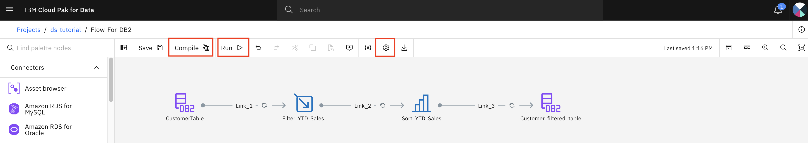

## Exercise 2. DataStage Runtime Environments

**This section is for information only. You don't have any task except review the information.**

An administrator or other user with appropriate permissions can set runtime environment definitions in DataStage®.

For each PX instance, you can create multiple runtime environments in which you define environment variables and partitioning that are used when jobs are run. Developers select a runtime environment when they run their jobs.

A DataStage job is a flow that is designated to run with an environment definition. You use environment definitions to control jobs. The relationship between DataStage flows and DataStage jobs is one to many.

You can designate an environment definition as a runtime setting from the DataStage designer canvas or from the Jobs tab.

### Step 2.1: Setting new environment definitions

**This step is for information only. No action to take.**

To set a new environment definition, complete the following steps,

1. Login to CP4D console.
1. Open you project.
1. Navigate to the `Manage` tab in your project.
1. Select `Environments` in the left pane.
1. Select `Templates` tab.
1. Click `New template +`.
1. Enter a name and optional description.
1. Select `DataStage` for the configuration type.
1. Select a hardware configuration from the drop-down menu.

    > Note: The hardware configurations that are listed in the drop-down menu are based on the instances of DataStage that are available to you with the permissions that you have. If you want to create an environment definition based on an instance that is not shown in the drop-down menu, then you must first create that new instance. To create the new instance, you must have sufficient permissions.

1. Select the number of partitions for the new environment.
1. Optionally, specify environment variables.
1. `Create`.

    

### Step 2.2: Choose runtime environment

**This step is for information only. No action to take.**

To choose a runtime environment for a DataStage flow, complete the following steps,

1. Login to CP4D console.
1. Open you project.
1. Select the dataStage flow to open it.

    

1. Click the Settings icon of the DataStage flow.
1. Under the `Runtime` section in the left pane, select `Run`.
1. Select an environment definition from the drop-down menu.

    

**This completes the current exercise.**
