## Exercise 3: Create a DataStage flow (file to file)

In this exercise, you will:

- Upload the source files to the project.
- Clone the previous transformation flow.
- Change the source and target for the cloned transformation flow.
- Run your DataStage flow and view your asset in the project and Cloud Object Storage.

This tutorial will approximately 20 minutes to complete.

### Step 3.1: Upload the Source Data File to Project

1. Login to CP4D console.
1. Open you project.
1. Navigate to the `Assets` tab.

    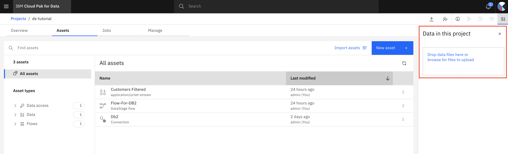

1. On the right of the screen, select `Drop data files here or browse for files to upload` link.
1. Select `data/Customers.csv` file. You should have access to the data file after download the repo.
1. `Open`.
1. File `Customers.csv` appears as one asset in the project.

    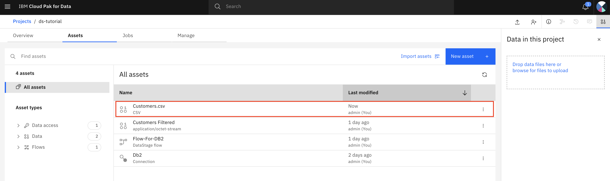

### Step 3.2: Clone the DataStage Flow

1. Open your Data Stage project `ds-tutorial`.
1. Navigate to the `Asset` tab.
1. Find the transformation flow `Flow-For-DB2` that you created earlier.
1. Click the three vertical dots to the far right and select `Duplicate`. 

    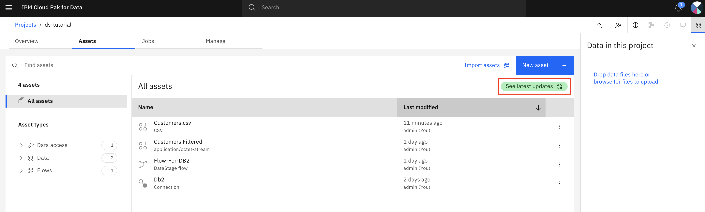

1. Once the replication action completes,  click the `See latest updates` link in the upper right.

### Step 3.3: Modify the DataStage Flow

1. Open the newly cloned DataStage flow by clicking on it.

    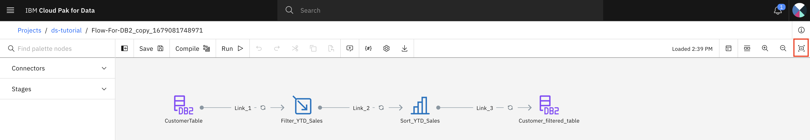

1. Select the `View flow info` icon at the top-right corner to open its property pane.

    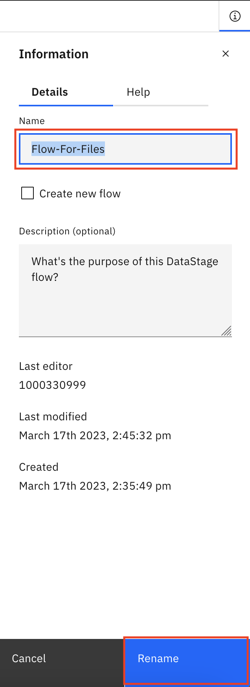

1. Change the flow name to `Flow-For-Files`.
1. `Rename`.
1. Right click the link `Link-1` (between the `CustomerTable` node and the `Filter_YTD_Sales` node) and select `Delete` to delete the link.
1. Right click DB2 source `CustomerTable` and select `Delete` to delete the node.
1. Right click the link `Link-3` (between node `Sort_YTD_Sales` and node `Customer_filtered_table`) and select `Delete` to delete the link.
1. Right click target node `Customer_filtered_table` and select `Delete` to delete the node.

    

1. In the left pane, expand `Connectors`.
1. Drag and drop `Asset browser` to the canvas on the right as the new data source.
1. Select `Data asset` -> `Customers.csv`.
1. `Add`.
1. Connect `Customers.csv_1` node and `Filter_YTD_Sales` node.

    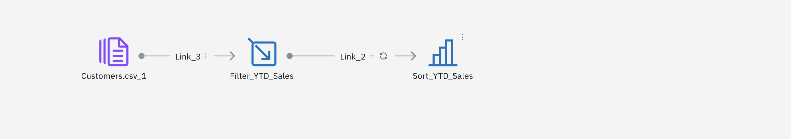

1. In the left pane, drag and drop `Asset browser` to the canvas on the right as the new data target.
1. Select `Data asset` -> `Customers.csv`.
1. `Add`.
1. Connect `Sort_YTD_Sales` node and `Customers.csv_2` node.

    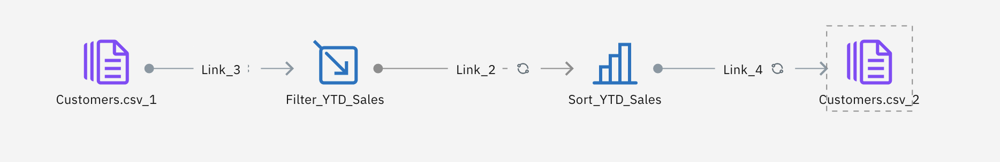

1. Double click the `Customers.csv_1` node to open its property pane. 
1. Rename it to `Customer_Source_File`.
1. Navigate to the `Output` tab.
1. Expand the Properties section. 
1. Copy the entire file path and file name in the `File*` field and save it. For example, `/px-storage/PXRuntime/Projects/f09d40ea-d5b1-4390-aa8b-16f54435fe7f/Customers.csv`.

    >Note: The Watson Studio project share the same storage of OpenShift cluster where the CP4D is deployed. The sample source file name above reflects PV/PVC of the OCP cluster. OCP cluster storageshould have been deployed and configured by your cluster administrator.

1. Click `Save` button to save the changes and close the property pane.
1. Right click `Customer_Source_File` node and select `Preview data` to verify your settings.

    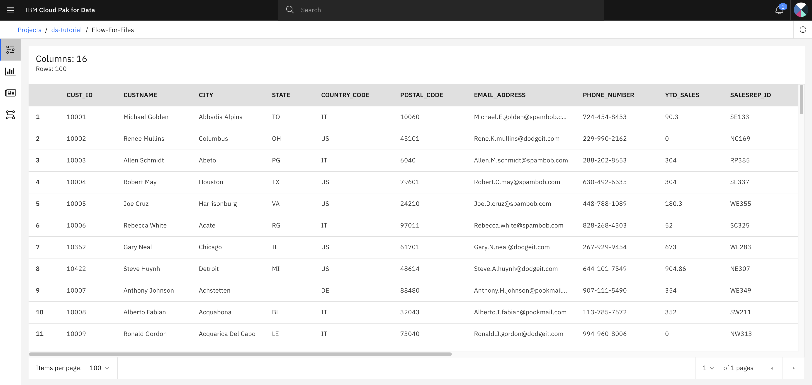

1. `Close` after preview.
1. Double click the `Customers.csv_2` node to open its property pane. 
1. Rename it to `Customer_Target_File`.
1. Navigate to the `Input` tab.
1. Expand the Properties section. 
1. Paste the entire file path and file name from `Customer_Source_File` node into the `File*` field. For example, `/px-storage/PXRuntime/Projects/f09d40ea-d5b1-4390-aa8b-16f54435fe7f/Customers.csv`.
1. Changed the file name to `Customers-new.csv`.

    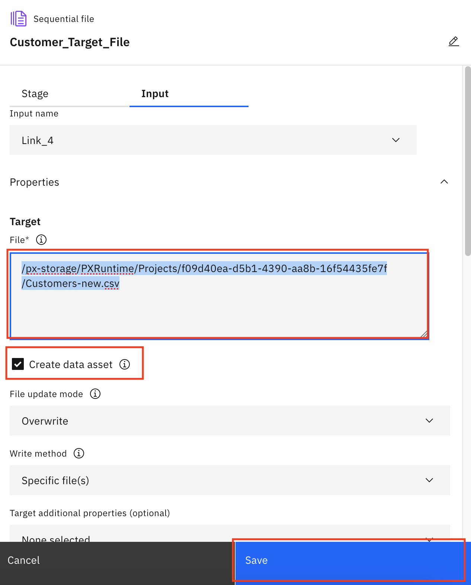

1. Make sure to select the check box `Create data asset`.
1. Click `Save` button to save the changes and close the property pane.
1. Right click `Customer_Target_File` node and select `Preview data` to verify your settings.

    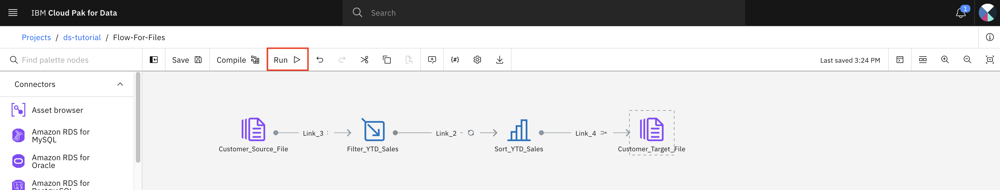

### Step 3.4: Run the DataStage flow

1. Click `Run` icon on the top of the screen.
1. It starts compiling and then run the job.
1. After a few seconds, the run completes.

    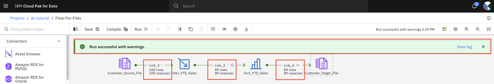

1. Detail messages appears under each link.
1. Navigate back to your DataStage project.

    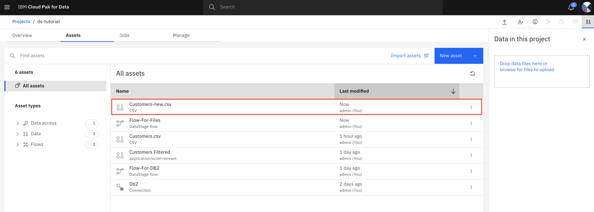

1. Verify the file `Customers-new.csv` was created.
1. Optionally, download the file to view its contents. It should have a list of rows that have YTD_Sales > 1000 and sorted in descending order.

**This completes the current lab.**
