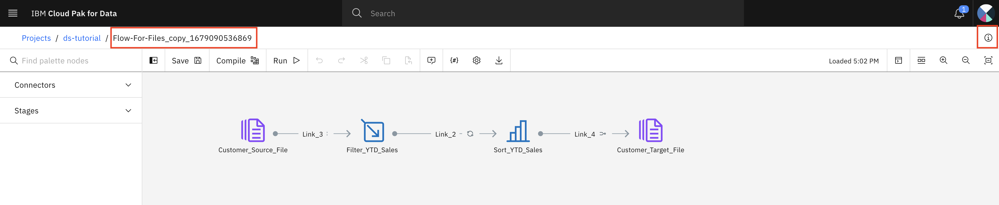
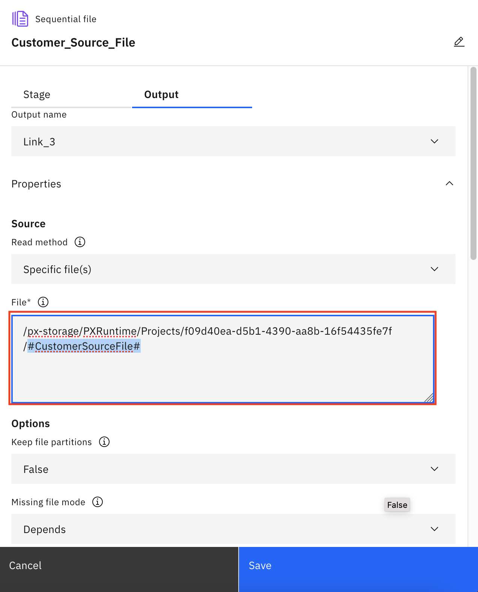
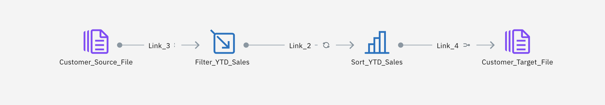
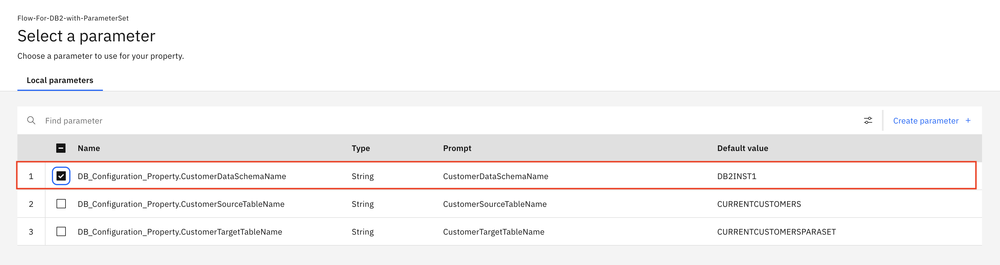

## Exercise 4: Parameters and Parameter Sets

Create a DataStage flow using user parameters, parameter sets, and environment variables in your jobs to specify information that your job requires at run time.

In this tutorial, you use parameters and parameter sets instead of hard coding configuration.

- Use parameters
    - Clone the previous transformation flow (file to file)
    - Change the source and target for the cloned transformation flow with parameters
    - Run your DataStage flow and verify your asset in the project and Cloud Object Storage
- Use parameter sets
    - Clone the previous transformation flow (DB2 to DB2)
    - Change the source and target for the cloned transformation flow with parameter sets
    - Run your DataStage flow and verify your asset in the project

### Step 4.1: Use Parameters for Sequential File Connector File Property (File Path)

1. Login to CP4D console.
1. Open you project `ds-tutorial`.
1. Navigate to the `Assets` tab.
1. Find the transformation flow `Flow-for-Files` that you created earlier.
1. Click the three vertical dots to the far right and select `Duplicate`. 
1. Once the replication action completes,  click the `See latest updates` link in the upper right.

1. Open the newly cloned DataStage flow by clicking on it.

    

1. Select the `View flow info` icon at the top-right corner to open its property pane.
1. Change the flow name to `Flow-For-Files-with-Parameters`.
1. `Rename`.
1. Open node “Customer_Source_File”.
1. Navigate to `Output` tab.
1. Expand the Properties section.
3. Move your curser to the lower right corner of `File*` section until the parameter icon shows up as below. (move your cursor to the top of `{#}`)

    

1. Click `{#}` to open the parameter window. 
1. `Create parameter +`.
1. Enter a new parameter `CustomerSourceFile` as the parameter name of the customer input file. Set the properties and values as below. 
    - Name = `CustomerSourceFile`
    - Type = `String`
    - Prompt = `Customer Source File`
    - Default Value = `Customers.csv`
1. `Create`.

1. `Create parameter +` to create additional parameters.
1. Enter a new parameter `CustomerTargetFile` as the parameter name of the customer input file. Set the properties and values as below. 
    - Name = `CustomerTargetFile`
    - Type = `String`
    - Prompt = `Customer Target File`
    - Default Value = `Customers-new-with-parameter.csv`
1. `Create`.

    

1. Click `Cancel` button without selecting any check box to close the parameter window.
1. Change the file name to `#CustomerSourceFile#` in the `File*` field and keep the file path. For example, `/px-storage/PXRuntime/Projects/f09d40ea-d5b1-4390-aa8b-16f54435fe7f/#CustomerSourceFile#`.

    >Note: The enclosing `#` signs around `#CustomerSourceFile#` indicate `CustomerSourceFile` is a parameter.

    

1. `Save`.
1. Right click `Customer_Source_File` and select `Preview data` to validate your property settings.
1. Close the `Preview data` window after reviewing data.
1. Double click node `Customer_Target_File` to open its property pane.
1. Navigate to `Input` tab.
1. Expand the Properties section.
1. Change the file name to `#CustomerTargetFile#` in the `File*` field and keep the file path. For example, `/px-storage/PXRuntime/Projects/f09d40ea-d5b1-4390-aa8b-16f54435fe7f/#CustomerTargetFile#`.

    

1. Make sure `Create data asset` check box is selected.
1. `Save`.

    

1. Run the flow and verify it run successfully.

    

1. Navigate to your project.
1. Go to the `Assets` tab.
1. Verify file `Customers-new-with-parameter.csv` is created in your project.

    

1. Optionally, download the file to view its contents. It should have a list of rows that have YTD_Sales > 1000 and sorted in descending order.

### Step 4.2: Use Parameter Set for DB2 Connector Properties (Schema Name, Table Name)

1. Login to CP4D console.
1. Open you project `ds-tutorial`.
1. Navigate to the `Assets` tab.
1. Find the transformation flow `Flow-For-DB2` that you created earlier.
1. Click the three vertical dots to the far right and select `Duplicate`. 
1. Once the replication action completes,  click the `See latest updates` link in the upper right.

1. Open the newly cloned DataStage flow by clicking on it.

    

1. Select the `View flow info` icon at the top-right corner to open its property pane.
1. Change the flow name to `Flow-For-DB2-with-ParameterSet`.
1. `Rename`.
1. Navigate back to your project `ds-tutorial`.
1. Go to the `Assets` tab.
1. `New asset +`.

    

1. Enter `parameter` in the search field.
1. Select `Parameter set` as the asset type.
1. On the New Parameter Set window, enter
    - Name = `DB_Configuration_Property`
    - Description = `DB Configuration Property`
1. `Create`.
1. Parameter set window appears.

    

1. `Create parameter +`.
1. Enter
    - Name = `CustomerDataSchemaName`
    - Prompt = `CustomerDataSchemaName`
    - Default value = `DB2INST1` 
    
    >Note: replace `DB2INST1` with your DB2 schema name and it can be different. You collected the information in previous section.

    

1. `Create`.
1. Repeat the same steps to create below 2nd parameter.
    - Name = `CustomerSourceTableName`
    - Prompt = `CustomerSourceTableName`
    - Default value = `CURRENTCUSTOMERS`

1. Repeat the same steps to create below 3rd parameter.
    - Name = `CustomerTargetTableName`
    - Prompt = `CustomerTargetTableName`
    - Default value = `CURRENTCUSTOMERSPARASET`

1. Now, your `Parameter set DB_Configuration_Property` should look like the screen shot below.

    

1. Go back to the `Assets` tab of your project `ds-tutorial`.

    

1. Open `Flow-For-DB2-with-ParameterSet` flow.

    

1. Select the `Add parameters` icon (`{#}`) on the top.
1. Navigate to the `Parameters set` tab.
1. `Add parameter sets +`.
1. Select the parameter set `DB_Configuration_Property`.
1. `Add`.
1. `Return to canvas`.
1. Double click `CustomerTable` node (source node) to open its property pane on the right. 
1. On the `Stage` tab, expand `Properties` section. 
1. Move cursor to the right of `Schema Name` property until `Parameterize` icon (`{#}`) appears.

    

1. Click the `Parameterize` icon (`{#}`).
1. Select parameter `DB_Configuration_Property.CustomerDataSchemaName`.

    

1. `Select`.
1. Repeat the same steps for `Table Name` property.
    - Select parameter `DB_Configuration_Property.CustomerSourceTableName` for the Table Name.

    

1. `Save`.
1. Right click the `CustomerTable` node and select `Preview data` to validate your configuration.
1. Close the `Preview data` window after reviewing.
1. Double click `Customer_filtered_table` node to open its property pane on the right.
1. On the `Stage` tab, expand Properties section. 
1. Move cursor to the right of `Schema Name` property until `Parameterize` icon (`{#}`) appears.
1. Click the `Parameterize` icon (`{#}`).
1. Select parameter `DB_Configuration_Property.CustomerDataSchemaName`.
1. Repeat the same steps for `Table Name` property.
    - Select parameter `DB_Configuration_Property.CustomerTargetTableName` for the Table Name.

    

1. `Save`.
1. Right click the `Customer_filtered_table` node and select `Preview data`.
1. You should receive error message to indicate that the target table does not exist.
1. Click `Run` icon on the top.
1. It may take couple of minutes.

    

1. `Run successful` message appears.
1. Detail messages appear under each link.
1. Right click the `Customer_filtered_table` node and select `Preview data`.
1. Data in the newly created target table appears.

    

1. Close the `Preview data` window.
1. Optionally, navigate to your database and view data in the target table.

**This completes this lab.**

