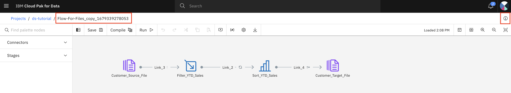
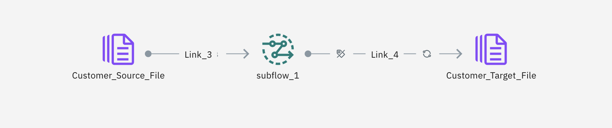
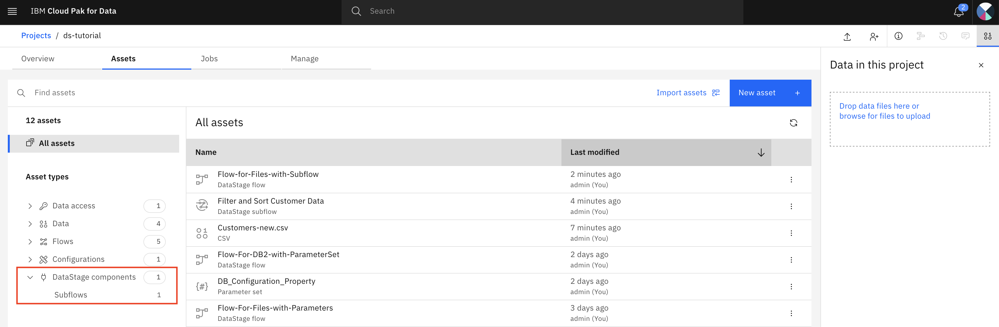
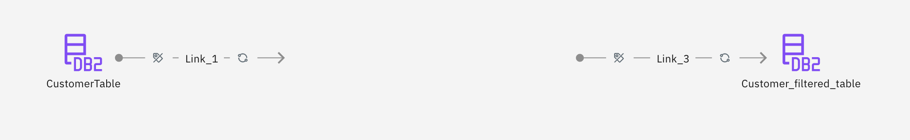
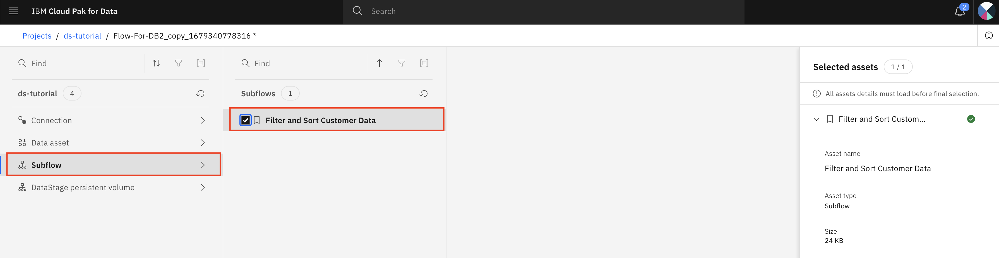
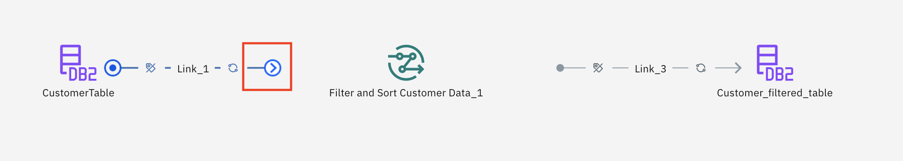

## Exercise 5: Reusable Subflows

You can create a DataStage flow and make part of the flow as a subflow. Reuse the subflow in another flow to simply the development of the new flow.

In this tutorial, you will:

- Create a new subflow
    - Clone the previous transformation flow (file to file)
    - Make the filter stage and sort stage as a local subflow
    - Run your DataStage flow and verify your asset in the project and Cloud Object Storage
    - Create a subflow from the local subflow so it can be shared and reused by other flows
- Reuse a subflow in another flow
    - Clone the previous transformation flow (DB2 to DB2)
    - Reuse the shared subflow in this new flow
    - Run your DataStage flow and verify your asset in the project and DB2

### Step 5.1: Create a new subflow

1. Login to CP4D console.
1. Open you project `ds-tutorial`.
1. Navigate to the `Assets` tab.
1. Find the transformation flow `Flow-for-Files` that you created earlier.
1. Click the three vertical dots to the far right and select `Duplicate`. 
1. Once the replication action completes,  click the `See latest updates` link in the upper right.

1. Open the newly cloned DataStage flow by clicking on it.

    

1. Select the `View flow info` icon at the top-right corner to open its property pane.
1. Change the flow name to `Flow-for-Files-with-Subflow`.
1. `Rename`.

1. To create a subflow, press and hold the `Shift` key and then click the `Filter_YTD_Sales` node and then also the `Sort_YTD_Sales` node.
1. Right-click in the white space, select `Create local subflow` menu option. 
1. The group is replaced by a local subflow stage.

    

1. Run your DataStage flow and validate that it runs successfully.
1. Now you make the local subflow a subflow that can be shared to other DataStage flows.
1. Right click Subflow subflow-1, then select `Create subflow`.
1. Enter subflow property values as below. 

    - Name = `Filter and Sort Customer Data`
    - Description = `Subflow to filter and sort customer data`

1. `Create`.
1. Notice the outside circle of the subflow now has dotted line now. 
1. Click the `Save` icon on the top of the flow canvas.

1. Go back to `Assets` tab of your project. 
1. Expand `DataStage Components` Section in the left pane.

    

1. Click `Subflow`. 
1. You should see the subflow `Filter and Sort Customer Data` that you just created.

### Step 5.2: Reuse a subflow in another flow

1. Login to CP4D console.
1. Open you project `ds-tutorial`.
1. Navigate to the `Assets` tab.
1. Find the transformation flow `Flow-for-DB2` that you created earlier.
1. Click the three vertical dots to the far right and select `Duplicate`. 
1. Once the replication action completes,  click the `See latest updates` link in the upper right.

1. Open the newly cloned DataStage flow by clicking on it.

    

1. Select the `View flow info` icon at the top-right corner to open its property pane.
1. Change the flow name to `Flow-for-DB2-with-Subflow`.
1. `Rename`.

1. Remove `Link-2` link (the link between `Filter_YTD_Sales` node and `Sort_YTD_Sales` node).
1. Remove `Filter_YTD_Sales` node and `Sort_YTD_Sales` node.

    

1. Expand the `Connectors` in the left palette.
1. Drag and drop the `Asset Brower` to the canvas between `Link_1` and
    `Link_3`. 
1. In the popup window, choose `Subflow` ->  subflow `Filter and Sort Customer Data`.

    

1. `Add`.

    

1. Connect the `CustomerTable` node and the subflow `Filter and Sort Customer Data_1` node by moving the endpoint of the link until it reaches the subflow node.
1. Connect the `Filter and Sort Customer Data_1` node and `Customer_filtered_table` node by moving the start point of the link until it reached the subflow node.
1. Click the `Save` icon on the top of the flow screen.

1. Double click `Customer_filtered_table` node to open its property pane.
1. On the `Stage` tab, expand the `Properties` section.
1. Change the table name to `CURRENTCUSTOMERS2` from `CURRENTCUSTOMERS1`.
1. 
1. Run your DataStage flow and verify that it runs successfully.

**This completes the current exercise.**
