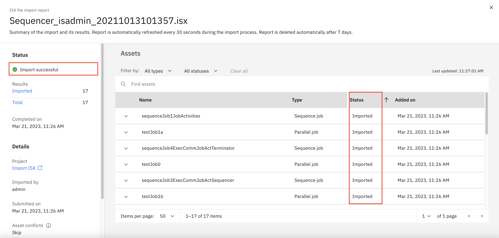

## Exercise 6: Import and Export DataStage Assets

Use import and export functions to exchange DataStage assets between Classic DataStage and NextGen DataStage, and between NextGen DataStages.

In this exercise, you

- Migrate DataStage jobs from classic DataStage into NextGen DataStage by importing an `isx` file exported from Classic DataStage
- Downloading and importing a DataStage flow and its dependencies

### Step 6.1: Migrate DataStage jobs from classic DataStage into NextGen DataStage

1. Login to CP4D console.
1. Go to the CP4D navigation menu.
1. Expand `Projects` section.
1. Select `All projects`.

    

1. `New project`.
1. Select `Create an empty project` tile.
1. Enter `Import ISX` as the name of the new project. 
1. `Create`.
1. Navigate to `Assets` tab.
1. `New asset +`.
1. Enter `DataStage` in the search field to narrow down the list. 
1. Select `DataStage` asset type.

    

1. Select `Local file` in the left pane.
1. `Browse`.
1. Select `data/Sequencer_isadmin_20211013101357.isx` file in the repo folder.

    

1. `Create`.

    

1. Importing starts.

    

1. When the importing is completed, you will see a green check mark and message `Import successful` in the top-left corner.
1. Close the import popup window. There will be 17 new flows added to your project “Import ISX”.
1. If you need to review the import page again. Click the `notification bell` icon next to your account name. You should see the notification message “DataStage import and asset creation completed.  Sequencer_isadmin_20211013101357.isx encountered 9 error. View import summary.” when the import was completed.
1. Click on the notification message, message `DataStage import and asset creation completed. Sequencer_isadmin_20211013101357.isx encountered 9 error. View import summary.`
1. Click `View import summary`. You will see the details of the import again. You can also save the import details in a CSV file by clicking `Download as CSV`.
18. Close the import summary window.

### Step 6.2: Download and import a DataStage flow and its dependencies

1. Follow the steps in Downloading and importing a DataStage flow and its dependencies
1. Practice how to download DataStage flow and its dependencies of your choice into a zip file.
1. Practice how to import the zip file into DataStage flow and its dependencies.

**This completes the current exercise.**
