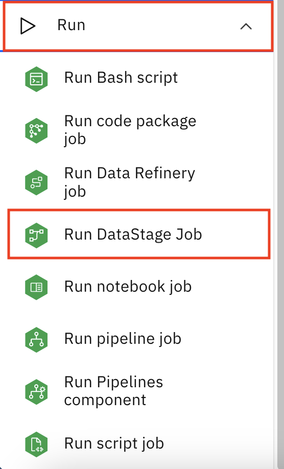

## Exercise 7: Watson Pipelines

The Watson Pipelines editor provides a graphical interface for orchestrating an end-to-end flow of assets from creation through deployment. Assemble and configure a pipeline to create, train, deploy, and update DataStage flows.

To design a pipeline that you drag nodes onto the canvas, specify DataStage pipeline nodes and parameters, then run and monitor the pipeline.

In this exercise, you

- Run a pipeline that executes a DataStage job
- Develop and run a pipeline that executes a sequence of DataStage jobs


### Step 7.1: Run a pipeline that executes a DataStage job

1. Login to CP4D console.
1. Go to the CP4D navigation menu.
1. Expand `Projects` section.
1. Select `All projects`.
1. Select project `Import ISX` to open it.
1. Go to `Assets` Tab. 
1. In the left pane, select `Asset type` -> `Flows` -> `Pipelines`.

    

1. Open pipeline `sequenceJob0JobActivity`.
1. Double click node `Job_Activity_0` in the canvas to see the details of node `Job_Activity_0`.
1. The node 
    - has `Run DataStage job` type 
    - runs flow “Import ISX/testJob0” 
    - with environment `Default DataStage PX`.

    

1. Click `Cancel` to close the node details panel.
1. Select `Run pipeline` and then select `Create a job`.

1. Specify `sequenceJob0JobActivity` for the job name.
1. `Next`.
1. `Next`.
1. `Next`.
1. Review the newly created job `sequenceJob0JobActivity`. 
1. Click `Create` to create the new job.

    

1. The `Job Details` page of job `sequenceJob0JobActivity` appears. 


1. Select `Run job` icon on the upper right corner to run job `sequenceJob0JobActivity`.
1. You see the job status `Running` for the latest job execution.
1. When the job completed, the status will show `Completed`.
1. The `Runs Completed` box will display ` 1 `.

    

1. Go back to the project `Import ISX`.
1. Navigate to the `Jobs` tab to display the job execution history. 
1. Sort the entries by the `Last modified` column.
1. Select the top entry of the list which is `sequenceJob0JobActivity`.
1. You should see the same screen that you observed a few minutes ago.


### Step 7.2: Run a pipeline that executes a sequence of DataStage jobs

1. Login to CP4D console.
1. Go to the CP4D navigation menu.
1. Expand `Projects` section.
1. Select `All projects`.
1. Select project `Import ISX` to open it.
1. Go to `Assets` Tab. 
1. In the left pane, select `Asset type` -> `Flows` -> `Pipelines`.
1. Select and open pipeline `sequenceJob1JobActivities`.
1. Double clik each of the 3 nodes `Job_Activity_0`, `Job_Activity_1` and `Job_Activity_2` and review the details of each node.
1. The pipeline will execute DataStage flow `Import ISX/testJob1a`, `Import ISX/testJob1b`, `Import ISX/testJob1c` in sequence.

    

1. Select `Run pipeline` and then select `Create a job`.
1. Specify `sequenceJob1JobActivity` for the job name.
1. `Next`.
1. `Next`.
1. `Next`.
1. Review the newly created job `sequenceJob1JobActivity`. 
1. Click `Create` to create the new job.

    

1. Select `Run job` icon on the upper right corner to run job `sequenceJob1JobActivity`.
1. You see the job status `Running` for the latest job execution.
1. When the job completed, the status will show `Completed`.
1. The `Runs Completed` box will display ` 1 `.
1. Go back to the project `Import ISX`.
1. Navigate to the `Jobs` tab to display the job execution history. 
1. Sort the entries by the `Last modified` column.
1. Select the top entry of the list which is `sequenceJob1JobActivity`.
1. You should see the same screen that you observed a few minutes ago.

    

1. Click the the datetime field of the entry under `Start time` to open the history.
1. Select the `Job_activity_0` node to show logs and Input/output on the right.


### Step 7.3: Develop a pipeline that executes a sequence of DataStage jobs


1. Follow the design of pipeline “sequenceJob1JobActivities” and develop your own pipeline that executes the same sequence of DataStage flows below.

```
“Import ISX/testJob1a”
“Import ISX/testJob1b”
“Import ISX/testJob1c”
```

1. Login to CP4D console.
1. Go to the CP4D navigation menu.
1. Expand `Projects` section.
1. Select `All projects`.
1. Select project `Import ISX` to open it.
1. Go to `Assets` Tab. 
1. `New Asset +`.
1. Search for `pipeline` to narrow down the choice.
1. Select `Pipelines`.
1. Enter `mySequenceJob99JobActivities` as the pipeline name.
1. `Create`.
1. Expand the `Run` section in the left pane.

    

1. Drag and drop `Run DataStage Job` to the canvas on the right.
1. Double click the new node to open its properties pane on the right.
1. Click `Select Job` dropdown menu.
1. Expand `Projects` section.
1. Select `Import ISX` project.
1. Select `testJob1a.DataStage job` from the list.

    

1. `Choose`.
1. Click `Select environment` dropdown list.
1. Select `Default DataStage PX` option.
1. `Save`.

1. Repeat the process to add `testJob1b.DataStage job`.
1. Repeat the process to add `testJob1c.DataStage job`.

    

1. Connect to the 3 nodes. 

    >Note: find the starting point of the connection around the bottom of the starting node.

    

1. Select `Run pipeline` and then select `Create a job`.
1. Enter `mySequenceJob99JobActivities` as the job name.
1. `Next`.
1. `Next`.
1. `Next`.
1. Review the newly created job `mySequenceJob99JobActivities`. 
1. Click `Create` to create the new job.

    

1. Select `Run job` icon on the upper right corner to run job `mySequenceJob99JobActivities`.
1. You see the job status `Running` for the latest job execution.
1. When the job completed, the status will show `Completed`.
1. The `Runs Completed` box will display ` 1 `.
1. Click the the datetime field of the entry under `Start time` to view details.

    

1. Select the `Job_activity_0` node to show logs and Input/output on the right.


**This completes the current exercise.**
