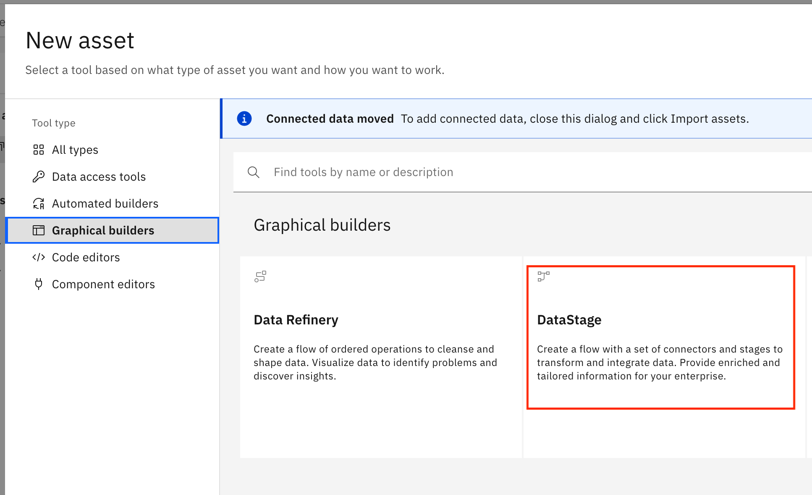

# Hadoop HDFS on AWS DataStage Flow Tutorial 

<p align="center">
  
  
</p>

## About

- This guide provides a detailed walkthrough on setup of Apache HDFS on an AWS EC2 node running Amazon Linux 2. The end result will be a pseudo-distributed Apache Hadoop Distributed File System with WebHDFS enabled, which can connect to 3rd party applications and serve HTTP requests. 

- A single node pseudo-distributed HDFS architecture was chosen so that users of the guide could learn end-to-end Apache HDFS setup without a massive time investment. While Apache HDFS is usually intended to run on many nodes, this guide should be a great start for initial HDFS setup. 

- ***To scale this guide up for more nodes:*** The fully configured node from this guide should be regarded as your new NameNode. The resulting Apache HDFS architecture can be extended for further nodes by spinning up more EC2 instances to serve as DataNodes (and/or a Secondary NameNode). Each node added will need to be setup with Java, required software packages, environment variables, and completed config (`hadoop-env.sh`, `core-site.xml` and `hdfs-site.xml`) files as the NameNode was. There will be some differences to the properties specified in the `core-site.xml` and `hdfs-site.xml` files on the added DataNodes. On the NameNode, the `workers` file must be edited to contain the DataNode IPs, and the `core-site.xml` and `hdfs-site.xml` config properties will require edits to reflect the fully-qualified domain names (FQDNs) of added DataNodes, the new replication count, etc. For more details on setting up fully distributed Apache HDFS, see [here](https://hadoop.apache.org/docs/stable/hadoop-project-dist/hadoop-common/ClusterSetup.html).

- Successful DataStage Flows using this guide have been verified for:

  - CP4D on ROSA <> Apache HDFS on AWS EC2 w/ Amazon Linux 2
  - CP4D on IBM Cloud <> APache HDFS on AWS EC2 w/ Amazon Linux 2


## Table of Contents

- [Hadoop HDFS on AWS DataStage Flow Tutorial](#hadoop-hdfs-on-aws-datastage-flow-tutorial)
	- [About](#about)
	- [Table of Contents](#table-of-contents)
	- [1. Single Node Basic Configuration](#1-single-node-basic-configuration)
		- [1.1 Create an AWS Free Tier Account](#11-create-an-aws-free-tier-account)
		- [1.2 Create an EC2 Template for HDFS Nodes](#12-create-an-ec2-template-for-hdfs-nodes)
		- [1.3 Note Instance Details and SSH to Node](#13-note-instance-details-and-ssh-to-node)
		- [1.4 Correctly configure runtimes and software on the Node](#14-correctly-configure-runtimes-and-software-on-the-node)
		- [1.5 Set up environment variables and .bashrc](#15-set-up-environment-variables-and-bashrc)
		- [1.6 Set up Node Local Filesystem and add Input Data](#16-set-up-node-local-filesystem-and-add-input-data)
	- [2. Single Node pseudo-distributed HDFS environment](#2-single-node-pseudo-distributed-hdfs-environment)
		- [2.1. Psuedo-distributed HDFS config files](#21-psuedo-distributed-hdfs-config-files)
		- [2.2 Passwordless ssh setup](#22-passwordless-ssh-setup)
		- [2.3 Format the NameNode](#23-format-the-namenode)
		- [2.4 Start NameNode daemon and DataNode daemon](#24-start-namenode-daemon-and-datanode-daemon)
		- [2.5 Browse NameNode web interface](#25-browse-namenode-web-interface)
		- [2.6 Set up HDFS File System](#26-set-up-hdfs-file-system)
		- [2.7 Set up WebHDFS](#27-set-up-webhdfs)
		- [2.8 Various Gotchas to Look Out For](#28-various-gotchas-to-look-out-for)
	- [3. Connect CP4D to Hadoop HDFS](#3-connect-cp4d-to-hadoop-hdfs)
		- [3.1. Configure a Connection in the CP4D Project](#31-configure-a-connection-in-the-cp4d-project)
	- [4. Build a Data Flow that Performs I/O with Apache HDFS](#4-build-a-data-flow-that-performs-i/o-with-apache-hdfs)
		- [4.1 Build a Data Flow](#41-build-a-data-flow)
		- [4.2 Verify Successful ETL](#42-verify-successful-etl)


 
    


## 1. Single Node Basic Configuration

### 1.1 Create an AWS Free Tier Account

1. Point your web browser [here](https://portal.aws.amazon.com/billing/signup#/start/email), and fill out your information to create an AWS free tier account. 


### 1.2 Create an EC2 Template for HDFS Nodes

1. Navigate to the EC2 dashboard within AWS by clicking on `Launch a virtual machine`. 

    

2. Go to the `Launch Templates` tab in the left sidebar. Here we will create a template to launch our HDFS node(s) from. In this tutorial we will spin up a pseudo-distributed Apache HDFS on a single node, but you may want to scale to more nodes in the future. 
3. Click `Create Launch Template`. 

    

4. Give your template a name. I chose the name 'HDFS-Node-Template'.
5. Choose one of the free tier official Amazon Linux 2 Machine Images. It is very important that your node runs on Amazon Linux 2 for compatibility with all of the commands and software packages used in this guide. Other AMIs will work, but may require lots of tinkering. This guide has already resolved the kinks in setup with HDFS 3.3.5 on AL2. Pictured below is the exact image used in this guide. 

    

6. We won't need a ton of compute power or memory. Choose instance type `t2.micro`.

    

7. In the key-pair section, click `Create new key pair`, give that key-pair a name, and copy the key-pair into your `~/.ssh` directory on your local machine, so that you can SSH into your EC2 node later. Here, my key-pair is named `hdfs-key1.pem`. 

    

8. The security group section is critical to making sure that HTTP requests sent to your HDFS cluster work correctly, and for making sure that WebHDFS can be configured. Make sure that inbound traffic is open from all sources. Click `Create new security group` and configure the settings as below. 

    

      > Note: In a production environment you will not want such relaxed security rules. In that case, you can whitelist the specific traffic necessary to make HDFS, WebHDFS, etc. connections work without opening to other traffic. The exact settings will depend on your production environment.

9.  SSD storage with 8 GB capacity should be plenty. The following EBS (Elastic Block Store) storage was used for the guide node's configuration. 

    

10. Save your template.
11. Now, navigate back to the `Instances` tab from the sidebar.
12. Click the arrow to the right of `Launch instance` and select `Launch from template`. 
13. Select the template you just created (for me, "HDFS-Node-Template"), and confirm that the settings all look correct then click `Launch Instance`. 

### 1.3 Note Instance Details and SSH to Node

1. In the `Instances` tab you should see an instance spinning up. When it finishes spinning up you should see an "Instance State" of "Running" and eventually a successful "Status Check". Click the edit symbol in the "Name" to give your node a name. Here is what my node looks like: 
2. Click the checkbox on the left of your Instance Name to see important details about your node. Make note of the following, as they will be used throughout the rest of the guide: `Public IPv4 address`, `Private IPv4 addresses`, `Private IP DNS name (IPv4 only)`, and `Public IPv4 DNS`. 
    > Throughout the rest of the guide, these will be referenced as `{Public IPv4 address}`, `{Private IPv4 addresses}`, `{Private IP DNS name (IPv4 only)}`, and `{Public IPv4 DNS}` where the corresponding values need to be filled in for config files etc.
3. Set up SSH to your Amazon Linux 2 EC2 node from your local machine. First, set an alias for the node's public IP address: 
   > Feel free to add the above command into the shell initialization file used for your local shell configuration so that you don't need to rerun it each time you restart your shell to have the alias available (ie: `~/.bashrc` or `~/.zshrc` most likely).

    `$ export HDFS_NODE={Public IPv4 address}`

  

4. Now, assuming your `.pem` file is also named `hdfs-key1.pem`, the following command can be used to ssh into your EC2 node from your local machine: 
   
    `$ ssh -i .ssh/hdfs-key1.pem ec2-user@$HDFS_NODE`

    > Say yes when prompted to add your EC2's Public IP to known hosts.

### 1.4 Correctly configure runtimes and software on the Node

> Note: Please be very careful following the steps in this section. Lots of time went into finding the correct software versions and configuration to allow Apache HDFS + WebHDFS to run smoothly. 

1. SSH into your node.
   
   `$ ssh -i .ssh/hdfs-key1.pem ec2-user@$HDFS_NODE`

2. Download the "extra packages repo", EPEL. This contains several important software packages we need to get WebHDFS running. 

    `$ sudo rpm -ivh https://dl.fedoraproject.org/pub/epel/epel-release-latest-7.noarch.rpm`

3. Update the package index, "yum". 
   >The package index is a tool which keeps track of package names across your downloaded repos so that you can easily download and update linux software packages.

    `$ sudo yum update -y`

4. Install openjdk for java 8. This is one of the most highly recommended versions for compatability with HDFS, but any Java 8 will compiled with HDFS. 

    `$ sudo yum install java-1.8.0-openjdk-devel -y`

    Then run 

    `$ java -version` 
    
    and you should see the following output: 

        openjdk version "1.8.0_362" 
        OpenJDK Runtime Environment (build 1.8.0_362-b08) 
        OpenJDK 64-Bit Server VM (build 25.362-b08, mixed mode)


5. Install pdsh for better resource management:

    `$ sudo yum install pdsh -y`


6. Get OpenSSH and start an sshd (ssh server service):

    `$ sudo yum install openssh-server -y`

    `$ sudo systemctl start sshd`


7. Download Hadoop (Stable versions can be found [here](https://www.apache.org/dyn/closer.cgi/hadoop/common/)).

    For the exact version used in this guide, the following command was executed to download hadoop from the web:

    `$ wget https://archive.apache.org/dist/hadoop/common/hadoop-3.3.5/hadoop-3.3.5.tar.gz`

8. It may take a few minutes to download. Once downloaded, unzip the hadoop distribution as follows: 

    `$ tar -xzf hadoop-3.3.5.tar.gz`

    This may also take a minute.

### 1.5 Set up environment variables and .bashrc

1. First, locate where OpenJDK installed on your machine. To do so, run the following command: 

    `$ sudo update-alternatives --config java`

    For my machine, the location was found at: "/usr/lib/jvm/java-1.8.0-openjdk-1.8.0.362.b08-1.amzn2.0.1.x86_64/jre/bin/java".

    You will want to set JAVA_HOME to the parent directory of the `jre` folder, which contains the Java Runtime Environment. 

2. To edit `.bashrc` for your user on the EC2 node (named `ec2-user` if you used the default username during your EC2 template setup), type the following (you could use vi or vim as well, of course) to edit your bash shell initialization file:

    `$ nano ~/.bashrc`

3. Now add the following line to the file:

    `$ export JAVA_HOME=/usr/lib/jvm/java-1.8.0-openjdk-1.8.0.362.b08-1.amzn2.0.1.x86_64`

4. Your `~/.bashrc` file should look like the following now (your install path may be different): 

    ```bash
    # .bashrc

    # Source global definitions
    if [ -f /etc/bashrc ]; then
            . /etc/bashrc 
    fi

    # Uncomment the following line if you don't like systemctl's auto-paging feature:
    # export SYSTEMD_PAGER=

    # User specific aliases and functions

    # Set env vars
    export JAVA_HOME=/usr/lib/jvm/java-1.8.0-openjdk-1.8.0.362.b08-1.amzn2.0.1.x86_64
    ```
   
5. If using nano to edit the file: Now type `^X` and `y` at the prompt to save your changes. 

6. Now type the following command to make sure the `JAVA_HOME` is available in our current bash session.
    
    `$ source .bashrc`
    > .bashrc will be automatically sourced on each bootup in the future, so you don't need to worry about sourcing `JAVA_HOME` each time you boot up the node. 

7. Now repeat the process and add environment variables `HADOOP_DIR=/path/to/hadoop` and `HADOOP_CONF_DIR=/path/to/hadoop/conf/files` in `.bashrc` and source it once again. For me these, values were `HADOOP_DIR=~/hadoop-3.3.5` and `HADOOP_CONF_DIR=$HADOOP_DIR/etc/hadoop`.

8. Your `~/.bashrc` file should look like the following now (paths may differ):
   ```bash
    # .bashrc

    # Source global definitions
    if [ -f /etc/bashrc ]; then
            . /etc/bashrc 
    fi

    # Uncomment the following line if you don't like systemctl's auto-paging feature:
    # export SYSTEMD_PAGER=

    # User specific aliases and functions

    # Set env vars
    export JAVA_HOME=/usr/lib/jvm/java-1.8.0-openjdk-1.8.0.362.b08-1.amzn2.0.1.x86_64
    export HADOOP_DIR=~/hadoop-3.3.5
    export HADOOP_CONF_DIR=$HADOOP_DIR/etc/hadoop
    ``` 

9. Source your initialization file again, or restart your shell and re-SSH into the EC2 node: 

    `$ source .bashrc`

10. Change directory into the filepath where your Apache HDFS 3.3.5 distribution lies: 

    `$ cd $HADOOP_DIR`. 

11. We need to edit `$HADOOP_DIR/etc/hadoop/hadoop-env.sh`. Add the following line (using nano, vi, vim, etc. as you did for editing `~/.bashrc`). There should be a place in the `hadoop-env.sh` file commented out waiting for you to uncomment and add the directory location for JAVA_HOME. If you can't find it, feel free to export the JAVA_HOME variable anywhere.

    ```bash
    ...

    # The java implementation to use. By default, this environment
    # variable is REQUIRED on ALL platforms except OS X!
    export JAVA_HOME=/usr/lib/jvm/java-1.8.0-openjdk-1.8.0.362.b08-1.amzn2.0.1.x86_64

    ...
    ```

12. At this point, if you run the following command (from within the hadoop distribution directory), you should see a bunch of information pop up on hadoop script usage:

    `$ bin/hdfs`


### 1.6 Set up Node Local Filesystem and add Input Data

1. If not already logged into your EC2 instance, SSH back into the EC2 instance:

    `$ ssh -i .ssh/hdfs-key1.pem ec2-user@$HDFS_NODE`

2. Make an input directory for data you want to input for MapReduce or other data processing such as IBM DataStage later.
   
    `$ mkdir input`

3. Do the same for output data. Both of these directories will be used for transfer between the local EC2 node and pseudo-distributed HDFS filesystem.

    `$ mkdir output`

4. Add data to the input folder. One way to do this is to download Cyberduck to your local computer (not the EC2 node) from [here](https://cyberduck.io/download/).

5. If adding files via Cyberduck, configure a SFTP (Secure File Transfer Protocol) between your local computer and the EC2 node. Select `SFTP`, copy `{Public IPv4 address}` into the Server cell, use Port `22`, and provide the username to log in as. If you did not modify the default EC2 username it should be `ec2-user`. Finally, specify the SSH Private Key file, which will be `~/.ssh/hdfs-key1.pem` if you followed the naming conventions in this guide. 

    

6. Connect to the SFTP you just set up.
7. You should see the local filesystem on the EC2 node, something like the following: 

    

8. Using cyberduck add [this](https://www.kaggle.com/datasets/kyanyoga/sample-sales-data) sample sales dataset to the `input` directory on your EC2 node. Simply drag the unzipped datafile from your local computer into the `input` directory on the EC2 node in Cyberduck's GUI. 

    

    >You will not see the `employees.csv` dataset, that was used separately from this guide.

    >I will later use the sales dataset in an IBM DataStage Flow to demonstrate how Apache HDFS can be connected with external tools via WebHDFS.


## 2. Single Node pseudo-distributed HDFS environment 

Hadoop can actually run as a single java process on this one EC2 node, which is good for debug purposes when developing MapReduce scripts. However, this doesn't mimic a more realistic Hadoop file system. We will set up a pseudo-distributed environment with multiple java processes. 


### 2.1. Psuedo-distributed HDFS config files

1. Write the following into your `$HADOOP_DIR/etc/hadoop/core-site.xml` config file, replacing {Public IPv4 DNS} with the Public IPv4 DNS for your EC2 node:

    ```xml
    <?xml version="1.0" encoding="UTF-8"?>
    <?xml-stylesheet type="text/xsl" href="configuration.xsl"?>
    <!--
      Licensed under the Apache License, Version 2.0 (the "License");
      you may not use this file except in compliance with the License.
      You may obtain a copy of the License at

        http://www.apache.org/licenses/LICENSE-2.0

      Unless required by applicable law or agreed to in writing, software
      distributed under the License is distributed on an "AS IS" BASIS,
      WITHOUT WARRANTIES OR CONDITIONS OF ANY KIND, either express or implied.
      See the License for the specific language governing permissions and
      limitations under the License. See accompanying LICENSE file.
    -->

    <!-- Put site-specific property overrides in this file. -->

    <configuration>
      <property>
        <name>fs.defaultFS</name>
        <value>hdfs://{Public IPv4 DNS}:9000</value>
      </property>
    </configuration>
    ```

2. Now write the following into your `$HADOOP_DIR/etc/hadoop/hdfs-site.xml` config file: 

    ```xml
    <?xml version="1.0" encoding="UTF-8"?>
    <?xml-stylesheet type="text/xsl" href="configuration.xsl"?>
    <!--
      Licensed under the Apache License, Version 2.0 (the "License");
      you may not use this file except in compliance with the License.
      You may obtain a copy of the License at

        http://www.apache.org/licenses/LICENSE-2.0

      Unless required by applicable law or agreed to in writing, software
      distributed under the License is distributed on an "AS IS" BASIS,
      WITHOUT WARRANTIES OR CONDITIONS OF ANY KIND, either express or implied.
      See the License for the specific language governing permissions and
      limitations under the License. See accompanying LICENSE file.
    -->

    <!-- Put site-specific property overrides in this file. -->

    <configuration>
      <property>
        <name>dfs.replication</name>
        <value>1</value>
      </property>
    </configuration>
    ```


### 2.2 Passwordless ssh setup

1. You can check if your EC2 instance has passwordless ssh to itself already set up by ssh'ing to the alias for the machine. `localhost` should be a valid alias for the loopback IP to the machine (127.0.0.1), but feel free to check in `/etc/hosts` for the loopback alias.

2. Type `$ ssh localhost`. 

3. Add the loopback IP to known hosts, and type "y". 

4. If permission is denied, you can setup passwordless ssh by generating an ssh key pair and copying the public key to `~/.ssh/authorized_keys`. 

    `$ ssh-keygen -t rsa -P '' -f ~/.ssh/id_rsa`

    `$ cat ~/.ssh/id_rsa.pub >> ~/.ssh/authorized_keys`

    `$ chmod 0600 ~/.ssh/authorized_keys`


### 2.3 Format the NameNode

The first time you set up HDFS you need to format your NameNode. We run this only once. Reformatting the namenode will wipe the entire Hadoop filesystem.

1. Remember to `cd` into the hadoop distribution directory before running this command.

    `$ cd $HADOOP_DIR`

2. Format the namenode.

    `$ bin/hdfs namenode -format`


### 2.4 Start NameNode daemon and DataNode daemon

1. Type the following command to start the HDFS file system (this command wraps a bunch of subcommands to get everything set up, but there are scripts to do things more piecewise if you so desire): 

    `$ sbin/start-dfs.sh`


### 2.5 Browse NameNode web interface

1. If everything up to this point has gone successfully, you should be able to see a web interface view of the NameNode by pointing your browser to: 

    `http://{Public IPv4 address}:9870/`

> Note: This assumes you are using port 9870 (the default) for WebHDFS

2. By default, the NameNode should be serving IP 9870 for this web interface, but if you don't see anything you may want to explicitly modify the web port property in your config files.
   >If nothing shows up and you've been following this guide carefully, it is more likely something in a previous section did not run successfully.

3. You should see something like this: 

    


### 2.6 Set up HDFS File System

1. Run the following commands to add a user directory with a user "hdfs_user" in your hadoop (pseudo)-distributed file system.

    `$ bin/hdfs dfs -mkdir /user`

    `$ bin/hdfs dfs -mkdir /user/hdfs-user`

2. Make a directory for your ec2 user username as well (probably `ec2-user`). This is the default directory for interacting with HDFS, and this directory is required for MapReduce jobs.

    `$ bin/hdfs dfs -mkdir /user/ec2-user`

3. You can run most typical linux filesystem commands from the dfs subcommand. You should see the user directory you created if you run the following:

    `$ bin/hdfs dfs -ls`

4. You can also now view your filesystem from the NameNode WebView by using `Utilities>Browse the file system`.

    

### 2.7 Set up WebHDFS

WebHDFS is required for connection to third party applications, such as IBM DataStage. We will set up a username and password for a new HDFS user, then connect to that user via WebHDFS. Then we will be able to read/write data to our Hadoop File System from third party applications, enabling things like IBM DataStage flows.

1. Enable HDFS by setting the dfs.webhdfs.enabled property to True in `$HADOOP_DIR/etc/hadoop/hdfs-site.xml`. This file should now look like the following: 

    ```xml
    <?xml version="1.0" encoding="UTF-8"?>
    <?xml-stylesheet type="text/xsl" href="configuration.xsl"?>
    <!--
      Licensed under the Apache License, Version 2.0 (the "License");
      you may not use this file except in compliance with the License.
      You may obtain a copy of the License at

        http://www.apache.org/licenses/LICENSE-2.0

      Unless required by applicable law or agreed to in writing, software
      distributed under the License is distributed on an "AS IS" BASIS,
      WITHOUT WARRANTIES OR CONDITIONS OF ANY KIND, either express or implied.
      See the License for the specific language governing permissions and
      limitations under the License. See accompanying LICENSE file.
    -->

    <!-- Put site-specific property overrides in this file. -->

    <configuration>
        <property>
    	    <name>dfs.replication</name>
            <value>1</value>
        </property>
        <property>
    	    <name>dfs.webhdfs.enabled</name>
    	    <value>true</value>
        </property>
    </configuration>
    ```

2. Also update the `core-site.xml` file in the same config directory with hadoop.security.authentication=simple and hadoop.security.authorization=false. This xml config file should now look like the below:
   
    ```xml
    <?xml version="1.0" encoding="UTF-8"?>
    <?xml-stylesheet type="text/xsl" href="configuration.xsl"?>
    <!--
      Licensed under the Apache License, Version 2.0 (the "License");
      you may not use this file except in compliance with the License.
      You may obtain a copy of the License at

        http://www.apache.org/licenses/LICENSE-2.0

      Unless required by applicable law or agreed to in writing, software
      distributed under the License is distributed on an "AS IS" BASIS,
      WITHOUT WARRANTIES OR CONDITIONS OF ANY KIND, either express or implied.
      See the License for the specific language governing permissions and
      limitations under the License. See accompanying LICENSE file.
    -->

    <!-- Put site-specific property overrides in this file. -->

    <configuration>
        <property>
    	    <name>fs.defaultFS</name>
            <value>hdfs://{Public IPv4 DNS}:9000</value>
        </property>
        <property>
            <name>hadoop.security.authentication</name>
            <value>simple</value>
        </property>
        <property>
            <name>hadoop.security.authorization</name>
            <value>false</value>
        </property>
    </configuration>
    ```

3. Download Apache HTTP Server Tools.

    `$ sudo yum install httpd-tools -y`

4. Make a conf folder for hadoop simple user authentication named `{$HADOOP_FOLDER}/etc/hadoop/conf`.

    `$ sudo mkdir etc/hadoop/conf`

5. Make a webhdfs user on the EC2 node.

    `$ sudo adduser webhdfs`

6. Add the webhdfs user to hadoop's authentication list along with a password.

    `$ sudo htpasswd -c etc/hadoop/conf/webhdfs.password webhdfs`

7. Enter the password twice, and confirm. Make note of this password, which I will now refer to as `{webhdfs_password}`.
   
8. Make sure to add a `/user/username` folder in hdfs whenever adding a new linux/hadoop user that you want to use to login to the hadoop filesystem. In this case, you need to make a `/user/webhdfs` directory:
   
    `$ bin/hdfs dfs -mkdir /user/webhdfs`

9. Copy in our input data file (previously added via Cyberduck) from the local node to the HDFS system:

    `$ bin/hdfs dfs -put ~/input/sales_data_sample.csv /user/webhdfs`

10. Now we need to modify the hadoop access control list (ACL). If we don't do this, we will be able to log in as our `webhdfs` user and see the filesystem, but we won't be able to actually read/write data contents. To add read, write, and execute permissions to the webhdfs user in HDFS folder `/user/webhdfs`, do the following:
    >Note: You must specify the -R (recursive) flag so that all files within this folder are owned by the webhdfs user. 

    `$ bin/hdfs dfs -setfacl -R -m user:webhdfs:rwx /user/webhdfs`

11.   Now let's get the ACL info and confirm that worked correctly. 
`$ bin/hdfs dfs -getfacl /user/webhdfs`

      > You should see the following output (at a minimum, the line with user::webhdfs    should match):
      >```# file: /user/webhdfs
      ># owner: ec2-user
      ># group: supergroup
      >user::rwx
      >user:webhdfs:rwx
      >group::r-x
      >mask::rwx
      >other::r-x
   
12. Verify also that `user::webhdfs` has rwx permissions on `/user/webhdfs/sales_data_sample.csv`, following the same command format.

13.  Now add the properties dfs.web.authentication.kerberos.principal, dfs.web.authentication.simple.anonymous.allowed, dfs.web.authentication.simple.username, dfs.web.authentication.simple.password to your `hdfs-site.xml` config file so that it looks like the following.
      > Note: If you were using Kerberos you would set up an actual Kerberos principal name, but we leave it as it is since we are using simple user/password authentication. If you named your user or password file differently, change the properties in the config as necessary.

      ```xml
      <?xml version="1.0" encoding="UTF-8"?>
      <?xml-stylesheet type="text/xsl" href="configuration.xsl"?>
      <!--
        Licensed under the Apache License, Version 2.0 (the "License");
        you may not use this file except in compliance with the License.
        You may obtain a copy of the License at

          http://www.apache.org/licenses/LICENSE-2.0

        Unless required by applicable law or agreed to in writing, software
        distributed under the License is distributed on an "AS IS" BASIS,
        WITHOUT WARRANTIES OR CONDITIONS OF ANY KIND, either express or implied.
        See the License for the specific language governing permissions and
        limitations under the License. See accompanying LICENSE file.
      -->

      <!-- Put site-specific property overrides in this file. -->

      <configuration>
          <property>
            <name>dfs.replication</name>
            <value>1</value>
          </property>
          <property>
            <name>dfs.webhdfs.enabled</name>
            <value>true</value>
          </property>
          <property>
            <name>dfs.web.authentication.kerberos.principal</name>
            <value>HTTP/_HOST@EXAMPLE.COM</value>
          </property>
          <property>
            <name>dfs.web.authentication.simple.anonymous.allowed</name>
            <value>false</value>
          </property>
          <property>
            <name>dfs.web.authentication.simple.username</name>
            <value>webhdfs</value>
          </property>
          <property>
            <name>dfs.web.authentication.simple.password</name>
            <value>/etc/hadoop/conf/webhdfs.password</value>
          </property>
      </configuration>
      ```

14. Rarely, DataNodes DNS resolution goes wrong. Unfortunately, this issue plagued me for hours trying to get HDFS to allow Data I/O because data transfer was being performed on a faulty DNS resolution. If you follow this guide to a T, you may find the same issue. To prevent it, manually specify the DNS with the following properties:

    • dfs.datanode.hostname={Public IPv4 DNS}

    • dfs.datanode.use.datanode.hostname=true

15. Your `hdfs-site.xml` config file should now look like the following:

    ```xml
    <?xml version="1.0" encoding="UTF-8"?>
    <?xml-stylesheet type="text/xsl" href="configuration.xsl"?>
    <!--
      Licensed under the Apache License, Version 2.0 (the "License");
      you may not use this file except in compliance with the License.
      You may obtain a copy of the License at

        http://www.apache.org/licenses/LICENSE-2.0

      Unless required by applicable law or agreed to in writing, software
      distributed under the License is distributed on an "AS IS" BASIS,
      WITHOUT WARRANTIES OR CONDITIONS OF ANY KIND, either express or implied.
      See the License for the specific language governing permissions and
      limitations under the License. See accompanying LICENSE file.
    -->

    <!-- Put site-specific property overrides in this file. -->

    <configuration>
        <property>
          <name>dfs.replication</name>
          <value>1</value>
        </property>
        <property>
          <name>dfs.webhdfs.enabled</name>
          <value>true</value>
        </property>
        <property>
          <name>dfs.web.authentication.kerberos.principal</name>
          <value>HTTP/_HOST@EXAMPLE.COM</value>
        </property>
        <property>
          <name>dfs.web.authentication.simple.anonymous.allowed</name>
          <value>false</value>
        </property>
        <property>
          <name>dfs.web.authentication.simple.username</name>
          <value>webhdfs</value>
        </property>
        <property>
          <name>dfs.web.authentication.simple.password</name>
          <value>/etc/hadoop/conf/webhdfs.password</value>
        </property>
        <property>
          <name>dfs.datanode.hostname</name>
          <value>ec2-54-67-104-53.us-west-1.compute.amazonaws.com</value>
        </property>
        <property>
          <name>dfs.datanode.use.datanode.hostname</name>
          <value>true</value>
        </property>
    </configuration>
    ```

16. It may also be a good idea to manually specify datanode address, RPC address, HTTP address, and secondary namenode address using the following property values (to prevent other default property errors). These values use the default ports:

    • dfs.namenode.rpc-address={Public IPv4 DNS}:9000

    • dfs.datanode.address={Public IPv4 DNS}:50010

    • dfs.datanode.http.address={Public IPv4 DNS}:50075
      
    • dfs.secondary.http.address={Public IPv4 DNS}:50090

17. Your `hdfs-site.xml` config file should now look like the following: 

    ```xml
    <?xml version="1.0" encoding="UTF-8"?>
    <?xml-stylesheet type="text/xsl" href="configuration.xsl"?>
    <!--
      Licensed under the Apache License, Version 2.0 (the "License");
      you may not use this file except in compliance with the License.
      You may obtain a copy of the License at

        http://www.apache.org/licenses/LICENSE-2.0

      Unless required by applicable law or agreed to in writing, software
      distributed under the License is distributed on an "AS IS" BASIS,
      WITHOUT WARRANTIES OR CONDITIONS OF ANY KIND, either express or implied.
      See the License for the specific language governing permissions and
      limitations under the License. See accompanying LICENSE file.
    -->

    <!-- Put site-specific property overrides in this file. -->

    <configuration>
        <property>
          <name>dfs.replication</name>
          <value>1</value>
        </property>
        <property>
          <name>dfs.webhdfs.enabled</name>
          <value>true</value>
        </property>
        <property>
          <name>dfs.web.authentication.kerberos.principal</name>
          <value>HTTP/_HOST@EXAMPLE.COM</value>
        </property>
        <property>
          <name>dfs.web.authentication.simple.anonymous.allowed</name>
          <value>false</value>
        </property>
        <property>
          <name>dfs.web.authentication.simple.username</name>
          <value>webhdfs</value>
        </property>
        <property>
          <name>dfs.web.authentication.simple.password</name>
          <value>/etc/hadoop/conf/webhdfs.password</value>
        </property>
        <property>
          <name>dfs.namenode.rpc-address</name>
          <value>ec2-54-67-104-53.us-west-1.compute.amazonaws.com:9000</value>
        </property>
        <property>
          <name>dfs.datanode.address</name>
          <value>ec2-54-67-104-53.us-west-1.compute.amazonaws.com:50010</value>
        </property>
        <property>
          <name>dfs.datanode.http.address</name>
          <value>ec2-54-67-104-53.us-west-1.compute.amazonaws.com:50075</value>
        </property>
        <property>
          <name>dfs.secondary.http.address</name>
          <value>ec2-54-67-104-53.us-west-1.compute.amazonaws.com:50090</value>
        </property>
        <property>
          <name>dfs.datanode.hostname</name>
          <value>ec2-54-67-104-53.us-west-1.compute.amazonaws.com</value>
        </property>
        <property>
          <name>dfs.datanode.use.datanode.hostname</name>
          <value>true</value>
        </property>
    </configuration>
    ```

18. Restart the HDFS service with the following commands:
    >This should resource your config files to enable the new properties you just added.

    >You must do this anytime you modify the configuration files such as `hdfs-site.xml` and `core-site.xml` if you want the changes to be reflected.
    
    `$ sbin/stop-dfs.sh`

    `$ sbin/start-dfs.sh`

19. Test if WebHDFS is working. One way to do this is to submit a simple request through WebHDFS from your local computer. Open a shell process from your local computer, and run the following command, replacing user, password and public IP address as necessary:

    `$ curl -i -u {webhdfs username}:{password} "http://{Public IPv4 DNS}:9870/webhdfs/v1/?op=LISTSTATUS"`
    
    >If this runs successfully you should see an output like the following, returning a json representation of the result of your submitted filesystem command:
    >```HTTP/1.1 200 OK
    >Date: Mon, 03 Apr 2023 22:46:21 GMT
    >Cache-Control: no-cache
    >Expires: Mon, 03 Apr 2023 22:46:21 GMT
    >Date: Mon, 03 Apr 2023 22:46:21 GMT
    >Pragma: no-cache
    >X-Content-Type-Options: nosniff
    >X-FRAME-OPTIONS: SAMEORIGIN
    >X-XSS-Protection: 1; mode=block
    >Content-Type: application/json
    >Transfer-Encoding: chunked
    >
    >{"FileStatuses":{"FileStatus":[
    >{"accessTime":0,"blockSize":0,"childrenNum":2,"fileId":16386,"group":"supergroup","length":0,>"modificationTime":1680501939617,"owner":"ec2-user","pathSuffix":"user","permission":"755",>"replication":0,"storagePolicy":0,"type":"DIRECTORY"}
    >]}}

> Note: The command provided in this step assumes you are running WebHDFS on port 9870. Modify the port number in the command if you have changed the WebHDFS port in the config files.

20. Also test whether data I/O is working correctly.
    1.  Point your browser to the webview
    
        `http://{Public IPv4 address}:9870/`
    2.  Navigate to `Utilities > Browse Filesystem`. 
    3.  Click through the filesystem until the data you uploaded `webhdfs/sales_data_sample.csv`. 
    4.  Click on the datafile, and output the head of the data.
    5.  If this runs successfully and returns the first several lines of your `.csv` file you are all set!
    6.  If not, see step #14.
    

### 2.8 Various Gotchas to Look Out For

1. ***The `setfacl` command in hdfs***: 

    You can no longer need to specify the -d flag in Apache HDFS 3.0.0 and later to trigger inheritance of permissions. Supposedly access control lists (ACLs) within the directory where you `bin/hdfs dfs -setfacl` will inherit permissions by default, but that has not been my experience. 
    
    If you add new data into your HDFS filesystem and something doesn't run as expected, check user permissions for whichever user you are attempting to access the data from. 

2. If your third party application runs slowly, you may want to increase the amount of time that  aclient will wait for a responde from a DataNode when reading data directly from the DataNode (short-circuit reads). The dfs.client.read.shortcircuit.streams.timeout property is a configuration parameter in Hadoop Distributed File System (HDFS) that specifies the maximum time in milliseconds that a client will wait for a response from the DataNode while short-circuit reading a block of data. Edit this property in `hdfs-site.xml`, if necessary. Values larger than 10000 will be brought down to 10000. Thus, below is the longest possible setting (10s).

    ```xml
    ...

        <property>
          <name>dfs.client.read.shortcircuit.streams.timeout</name>
          <value>10000</value>
        </property>

    ...
    ```

3. Set `$HADOOP_CONF_DIR` to make sure that configuration files are sourced correctly. If you notice that restarting the daemons via `sbin/stop-dfs.sh` and `sbin/start-dfs.sh` does not enact any changes, you may need to check your `$HADOOP_CONF_DIR` variable. Hadoop will look in this file path when sourcing its configuration.

4. `./$HADOOP_DIR/sbin/stop-dfs.sh` and `./$HADOOP_DIR/sbin/start-dfs.sh` anytime you make changes to your config files, so they can be re-sourced.

5. DO NOT reformat the NameNode unless as an absolute last resort. This will wipe your entire filesystem.

6. Use the command `jps` to see running java processes. On this pseudo-distributed single-node setup you should see processes for NameNode, DataNode, and Secondary NameNode. If not, something is misconfigured. Check the error logs.

7. Error logs lie in `$HADOOP_DIR/logs`. To avoid going through the massive files, try 

    `cat {log_file} | grep "ERROR"`

    and 

    `cat {log_file} | grep "WARN"`

8. Another useful debug strategy is to use the 

   `$ $HADOOP_DIR/bin/hdfs dfsadmin -report` 
   
   command to see a report on the active Apache HDFS environment. For a setup as described in this guide, you should see something like the following in your output. If no DataNode shows up or the IP address is completely wrong, check your configuration settings on properties relating to the datanode address and datanode DNS resolution.

    ```
    Configured Capacity: 8577331200 (7.99 GB)
    Present Capacity: 4329267200 (4.03 GB)
    DFS Remaining: 4329246720 (4.03 GB)
    DFS Used: 20480 (20 KB)
    DFS Used%: 0.00%
    Replicated Blocks:
    	Under replicated blocks: 0
    	Blocks with corrupt replicas: 0
    	Missing blocks: 0
    	Missing blocks (with replication factor 1): 0
    	Low redundancy blocks with highest priority to recover: 0
    	Pending deletion blocks: 0
    Erasure Coded Block Groups:
    	Low redundancy block groups: 0
    	Block groups with corrupt internal blocks: 0
    	Missing block groups: 0
    	Low redundancy blocks with highest priority to recover: 0
    	Pending deletion blocks: 0

    -------------------------------------------------
    Live datanodes (1):

    Name: 172.31.10.162:50010 (ip-172-31-10-162.us-west-1.compute.internal)
    Hostname: ec2-54-67-104-53.us-west-1.compute.amazonaws.com
    Decommission Status : Normal
    Configured Capacity: 8577331200 (7.99 GB)
    DFS Used: 20480 (20 KB)
    Non DFS Used: 4248064000 (3.96 GB)
    DFS Remaining: 4329246720 (4.03 GB)
    DFS Used%: 0.00%
    DFS Remaining%: 50.47%
    Configured Cache Capacity: 0 (0 B)
    Cache Used: 0 (0 B)
    Cache Remaining: 0 (0 B)
    Cache Used%: 100.00%
    Cache Remaining%: 0.00%
    Xceivers: 0
    Last contact: Thu Apr 06 06:02:30 UTC 2023
    Last Block Report: Thu Apr 06 06:02:19 UTC 2023
    Num of Blocks: 1

    ```


## 3. Connect CP4D to Hadoop HDFS

Congratulations! You should now have a fully functioning pseudo-distributed HDFS node with WebHDFS capabilities, and you're ready to connect HDFS with Third Party applications. We will connect to IBM's Cloud Pak 4 Data (CP4D).  

### 3.1. Configure a Connection in the CP4D Project

1. Your connection details for the completed Apache HDFS system should be as follows:
   ```
    username = {webhdfs user}
    uri = http://{Public IPv4 DNS}:9870/webhdfs/v1/
    {webhdfs user password}
   ```

2. Log into [IBM Cloud](https://cloud.ibm.com/).

3. Navigate to `Projects` in the dropdown sidebar.

    

4. Open a project, if one is already created for your data pipelines. 
   
   

5. If you do not have a data pipeline project yet:
   1. Click `New Project`
   2. Give your project a name
   3. Open the project.
   
  
6. Let's add a Connection for the Apache HDFS system we architected in the previous sections.
   
7. Click `New Asset`.

    

8. Select `Connection` for the asset type.

    

9.  Search "Apache" to find the Apache HDFS connection type. Select `Apache HDFS` for the connection type.

    

10. Configure the connection with the details from step #1. 
 
    

11. Click `Test Connection`. If the test is successful, move to the next section to build your data flow in DataStage.
    
12. If the test is unsuccessful:
    1.  Check the connection details you provided
    2.  Make sure your WebHDFS port matches
    3.  Check that your AWS EC2 node is up and running
    4.  Recheck that you can access your Apache HDFS system's webview on port 9870 through your broswer
    5.  Recheck that HTTP requests work with your Apache HDFS system
    
## 4. Build a Data Flow that Performs I/O with Apache HDFS

### 4.1 Build a Data Flow
1. From your project, click `New Asset`.
   
   

2. From `Graphical builders`, choose DataStage.

    

3. Give your DataStage asset a name, then open it.
4. Our flow is going to consist of an Input step loading data in from Apache HDFS, a Transform step where we filter the data to only include big sales, and then an Output step loading the filtered data out into Apache HDFS. In this way, we mimic a very basic ETL pipeline.
5. Drag two "Apache HDFS" `Connectors` into the flow building space.

    

6. Drag a "Filter" `Stage` into the flow building space.

    

7. Your unconnected flow should look something like this:

    

8. Hover over each icon and drag the flow arrows to create a connected flow from HDFS -> Filter -> HDFS.

    

9. Feel free to give each step and link a unique name to make your flow more readable.
10. Double click on the first Apache HDFS stage.
11. Edit the stage settings to pull data from the HDFS Connection configured in the previous section. Also include the file name you want to input into your flow.
    
    

12. To make sure the header (column names row) of your csv is handled correctly, check the `File format properties` settings and make sure they match the below.

    

13. Now let's edit the `Output` settings for the HDFS input stage. We need to make sure we output all of the columns we want from our sample sales data. The easiest way to do this is to import the columns from the csv.

    

14. Click on your connection, navigate to the sales data csv file, then import all columns.

15. You should now see that the columns have been imported into your first Apache HDFS stage's `Output` settings.

    

16. Click `Save` to save your changes, then go back to the flow builder space.

17. Now let's configure our `Filter` step. Double click on the icon for your `Filter` step.
18. Under `Stage` click `Edit` then add a WHERE clause which filters out any data with a sales amount less than $5000. The WHERE clause functions just as you would expect if you are familiar with SQL. 

    

19. Click `Save` and return to the flow builder space.
20. Finally, double click on the second Apache HDFS step (the output step) and configure its `Properties`.
    1.  Configure it to have the same Apache HDFS connection as the first HDFS step. We will save data back to the same Apache HDFS instance for simplicity. 
    2.  Give your output data a name. Here I use `sale_data_bigsalesonly.csv`.
    3.  Make sure the `First line is header` setting is checked.

      

21. Click `Save`.
22. Your flow should now be ready to go. Click `Compile`. If anything goes wrong, check the logs to see what you're missing or go back through the guide and make sure you completed all the steps and saved your changes.
23. Click `Run`. Again, if something goes wrong, check the logs.
24. When your flow has successfully run you should see something like the following. If you are using the exact same dataset and WHERE clause, you should have 2,823 input rows which get filtered to 549 "big sales" rows.
  
    


### 4.2 Verify Successful ETL

1. SSH back into your Apache HDFS NameNode.

    `$ ssh -i .ssh/hdfs-key1.pem ec2-user@$HDFS_NODE`

2. Navigate to the hadoop folder.

    `$ cd $HADOOP_DIR`

3. Move the output data into the local node's `output` folder.

    `$ bin/hdfs dfs -get /user/webhdfs/sale_data_bigsalesonly.csv ~/output`

4. Feel free to compare the files from the command-line. For something easier on the eyes, consider downloading the data back to your local computer and opening the CSVs in a GUI application such as `Microsoft Excel` or `Numbers`.
   
5. Using Cyberduck, connect to the Apache HDFS node again. Drag the input and output `.csv` files to your local computer. If you prefer to work from the command-line use something like `scp`.
   
6. Here is an image of my sales data before, collected from HDFS:

    
7. Here is an image of my sales data after, collected from HDFS. Note that the data is the same, but only big sales (with `SALES` amounts > 5000) have been retain.

    
8. Thus, we see that the ETL flow was successful in Data I/O and transformation with Apache HDFS. We have successfully connected CP4D's DataStage to Apache HDFS on AWS!


<><><><><><><><><><><><><><><><><><><>

<> Congratulations on Completing this Tutorial! <>

<><><><><><><><><><><><><><><><><><><>

If you have any questions, please reach out to Daniel.Frees@ibm.com.


 
