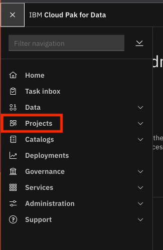
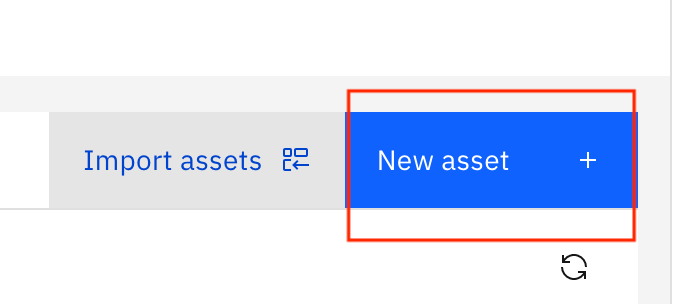
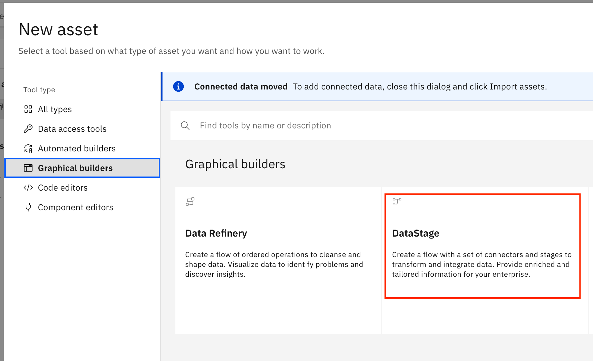
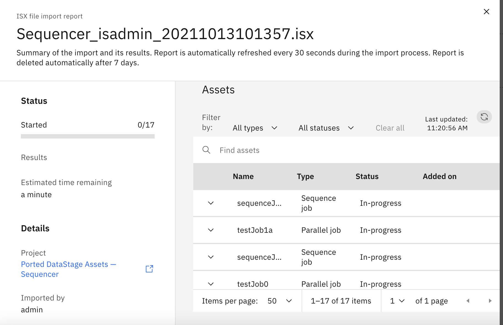
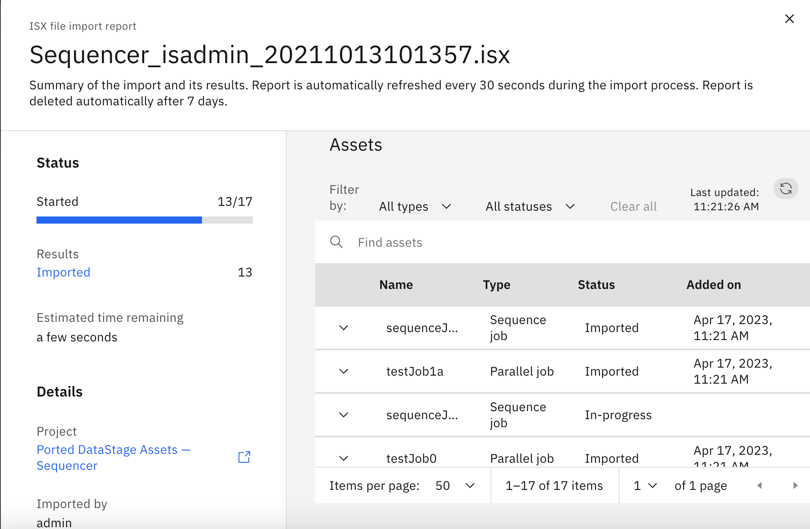
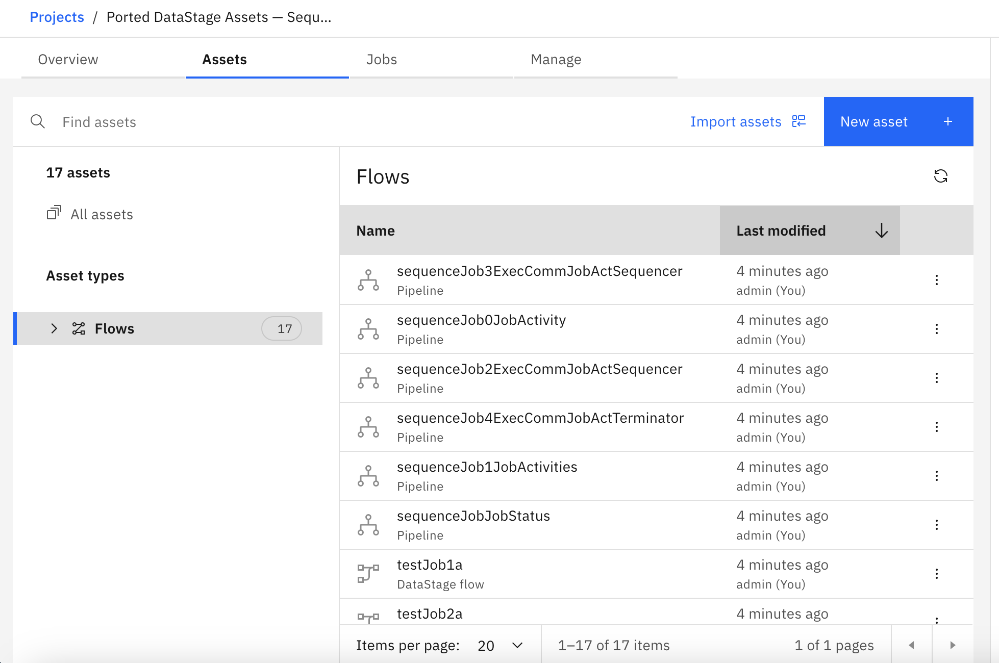
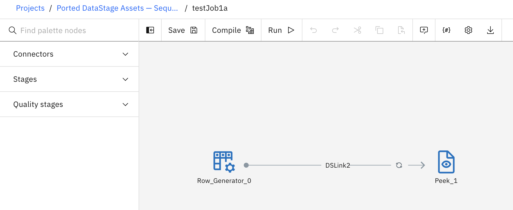

# Migrate DataStage Flows — Tutorial

This tutorial details the steps necessary to migrate DataStage assets across IBM cloud accounts, projects, different infrastructures/ DataStage deployements, or different DataStage versions.

## Table of Contents

- [Migrate DataStage Flows — Tutorial](#migrate-datastage-flows--tutorial)
  - [Table of Contents](#table-of-contents)
  - [1. Migrate DataStage Assets](#1-migrate-datastage-assets)
    - [1.1 Export DataStage Assets](#11-export-datastage-assets)
    - [1.2 Import DataStage Assets](#12-import-datastage-assets)

## 1. Migrate DataStage Assets

### 1.1 Export DataStage Assets

1. In this tutorial, we use a sample `.isx` file with a variety of DataStage assets (including pipelines and flows) to demonstre the migration process for DataStage assets. Sample files are provided in /data fold. 
2. If you do not have a .isx file of DataStage assets, you can create one from a DataStage project by following step #1 [here](https://www.ibm.com/docs/en/cloud-paks/cp-data/4.0?topic=data-migrating-datastage-jobs).

### 1.2 Import DataStage Assets

1. Log into your Cloud Pak for Data (CP4D) system, which can be deployed in [IBM Cloud](https://cloud.ibm.com/), any cloud infrastructure, or on-prem.

2. Navigate to `Projects` in the dropdown sidebar.
    
    

3. Open a project, if one is already created for your DataFlow assets.

4. If you do not have a project for your DataStage migration:
   1. Click `New Project`
   2. Give your project a name
   3. Open the project.

5.  From your project, click `New Asset`.
   
    

6. From `Graphical builders`, choose DataStage.

    

7. Elect to create the DataStage asset from local file, then drag and drop your `.isx` file from #1.1. For example, `data/CAP-dstage1-2020-11-10.isx` file.

8. Import the asset.

9. You should see a report of the items being imported, which will refresh every 30 seconds.

    

10. As the import continues, you will see a report on number of DataStage assets imported, assets that are deprecated, missing dependencies etc. If you are migrating old DataStage assets, you can therefore use this report to summarize how many of the assets were portable.

    

11. Once the import is completed, you should see all the DataStage Flow assets in your project.

    

12. If you go ahead and click into any of the assets, you should see the flows just as they were before export to `.isx`. For example, here is one of the flows from the "Sequencer" DataStage assets I imported in this tutorial:

    