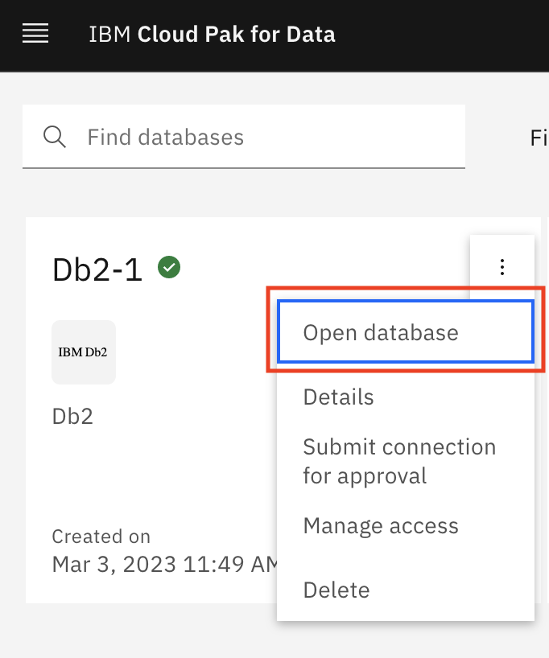
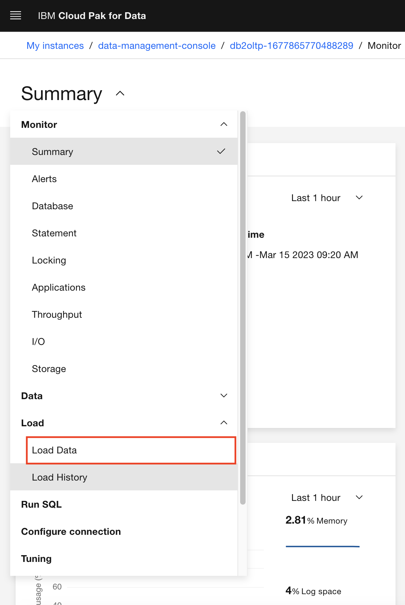
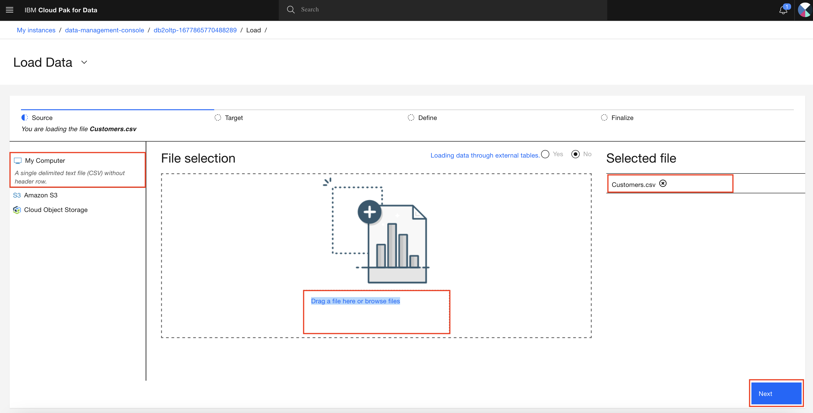
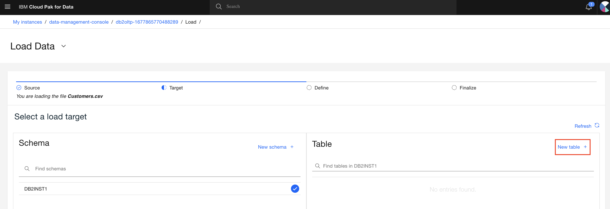
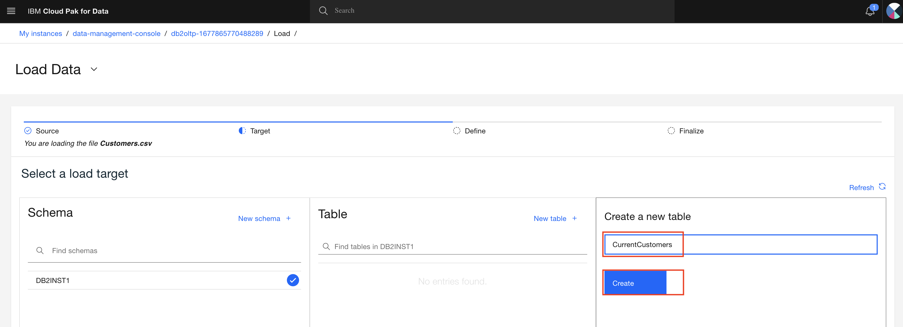
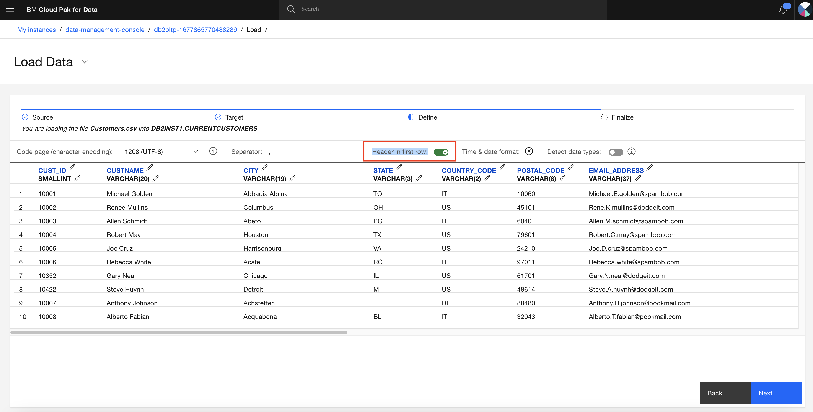

## Prerequisites and Preparations

To complete the exercise, you must have access to an instance of Cloud Pak for Data (CP4D). CP4D v4.6.3 was used to prepare the repo. Required CP4D components of the exercise include
- DataStage
- Watson Studio
- Db2
- Data Management Console (DMC)

You must also provision instance the following services.
- DataStage
- Db2
- Data Management Console (DMC)

Sample data assets are available in `/data` folder of the repo. To load `Customer.cvs` data into your database,

1. Login to CP4D console.
1. From the navigation menu, click `Data` > `Databases`. Database page appears.
1. Db2 database will be used as a source and a target. 
1. Click the 3 vertical dots of your database and select `Open database`.

    

1. Select the dropdown menu. By default, `Summary` is selected.
1. Select `Load` -> `Load Data`.

    

1. Under the `File selection` section, click the `Drag a file here or browse files` link.
1. Select `data/Customers.csv`.

    

1. `Next`.
1. Select your database schema. For example, DB2INST1.

    

1. Select `New table` under the `Table` section.
1. Name the new table `CurrentCustomers`.

    

1. `Create`.
1. `Next`.
1. You see a preview of the first 10 rows of the CurrentCustomers table.
1. `Header in first row:` flag is turned ON by default. Make sure it stays ON.

    

1. `Next`.
1. Review the data loading summary and make sure everything is OK.
1. Click the `Begin Load` button.
1. In the Notification area, you will see the data load job succeeded message. There are 100 rows loaded into the `CurrentCustomers` table.

You successfully created the `CurrentCustomers` table and uploaded sample data.
