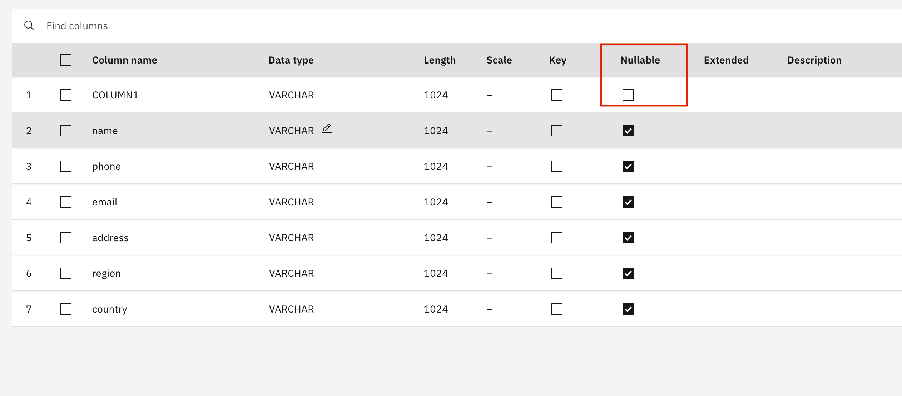

# S3 DataStage Flow

## Table of Contents
- [S3 DataStage Flow](#s3-datastage-flow)
  - [Table of Contents](#table-of-contents)
  - [1. Pre-requisites](#1-pre-requisites)
  - [2. Provision DataStage](#2-provision-datastage)
  - [3. Example Flow: Filtering](#3-example-flow-filtering)
    - [3.1 Construct Flow Diagram](#31-construct-flow-diagram)
    - [3.2 Configure Flow](#32-configure-flow)
    - [3.3 Run \& Verify Flow](#33-run--verify-flow)
    

## 1. Pre-requisites

1. Create a new project on IBM Cloud, or select an existing project you want to add your DataStage ETL flow to.
2. Set up connection to your S3 database in this project, by providing access credentials (ie: access key, secret key).

## 2. Provision DataStage

1. Navigate to your Cloud project, and select `New Asset`. 

2. Scroll down to "Graphical Builders" in the left menu and choose `DataStage Flow` for the new asset.

3. Name your asset, and optionally provide a description.

## 3. Example Flow: Filtering

### 3.1 Construct Flow Diagram

1. Open up the DataStage asset.
   
2. Add an S3 Connector for your input data.

3. Add a second S3 Connector for the final output.
   

4. Now add a filter step in between these two ends of the flow. 
> Note: In between your input and output steps, you can use any sort of transformation, filtering, agregation, etc. desired. Furthermore, it should be noted that DataStage is not limited to one single pipeline with one input and output. We are simply following a simple pipeline to demonstrate DataStage's capability to interact with Amazon S3 databases.
> 

5. Link up your pipeline. First, hover over `Amazon_S3_1` and drag the arrow that shows up to the right of it until it is linked with `Filter_1`. Then do the same between `Filter_1` and `Amazon_S3_2`.
   
   

6. Your overall flow should now look like this:
   

### 3.2 Configure Flow

7. Now it's time to edit the settings for each step of the flow. These settings make sure you are connected to the correct data instances, and allow you to customize transformations, choose columns to be passed along, name inputs/outputs, and even customize advanced processing settings when needed for ETL optimization. First, double click on the `Amazon_S3_1` node. Let's select the correct connection. From the connection dropdown menu, select the S3 connection you added to your project when you set it up.
   

8. Connect to your S3 database however you wish and find a file/table you want to work with. For this tutorial, I connected via Cyberduck. Here is a view of some of the files in S3 before running DataStage:
   

9.  Now, edit the output settings. We need to edit the columns that will be output through `Link_1` from `Amazon_S3_1`. The easiest way to set this up is to import the file/ table you want to use from S3 into the Cloud project, so you can import via template. Click `Edit`, then `Import Columns`, then select a data asset with the correct columns from your project. Here, I select "sample-data-employee-100-records.csv" from the Data Assets since that is the data flowing through this first Amazon S3 node. 
 > If the file/table is large, just import one row into your Cloud project.

 
 

10. Make sure the primary key of your data is marked as `not nullable`. The PK of our example dataset is an index column called "COLUMN_1".
    

11.  The filter step should automatically adjust its input columns to match the output just set for `Link_1`. If not, you can edit as pictured below.
    
   

12. For our filter transformation, we edit the `WHERE` clause under `Stage` to set up the value based filtering behavior. This functions the same way as a SQL WHERE clause. Here we choose to only retain records which have a `country` value of "Spain" or "New Zealand"
   

13. We can also edit our Output or Input columns to mimic the "SELECT ___ FROM" behavior of SQL. For this example, we delete the `address` column, and apply an alias of "email_address" to what was originally the `email` column.
    
    

14. Lastly, we need to set up our Output S3 node. We select the same connection & bucket as we did for our first node, following the same steps. We could connect to a different database if our usecase involved data transfer, but here we simply demonstrate an ETL job from/to the same S3 instance. 
15. We must also add our output file name. 
    

### 3.3 Run & Verify Flow

16. Compile the DataStage job. If any steps were missed, you can check the error log to find what went wrong and correct it. 
17. Run the DataStage job. Again, if some of the job setup is incomplete you will see a `Failure` message, and you can check the error log to correct the issue. 
18. Once the job has been successfully run, check your connected S3 database to confirm that your output is there, and as expected. Below, we see my S3 filesystem in Cyberduck after running the job from this tutorial.
    
   > Notice that the `filtered_employee_records` are now there. We got two batches for our output, which occurs because of some of the default DataStage advanced settings. Filenames are indexed in such a way that it is easy to recombine them altogether if needed. Batching improves throughput performance. 
19. Looking at each of the two output files, `filtered_employee_records.csv.0` and `filtered_employee_records.csv.1`, we see that our column and row-value filtering performed as expected. Only records with country values of "Spain" or "New Zealand" are retained, and home addresses are dropped. 
 
 