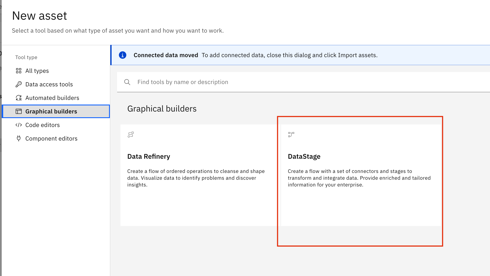
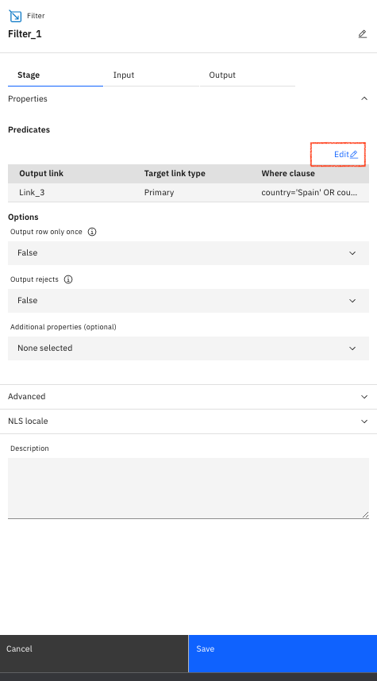
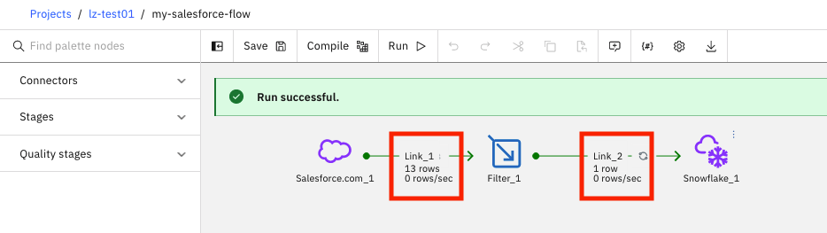

# Salesforce (to Snowflake) DataStage Flow 

In this exercise, you are going to build a DataStage flow to read contents from Salesforce table `ACCOUNT`. You filter the contents as a sample data transformation. Then, you create a table in Snowflake system and store your transformed data there.

## 1. Pre-requisites

### 1.1 Explore Salesforce

1. Create a Salesforce Free Tier account from [this](https://www.salesforce.com/ap/form/signup/freetrial-sales/) link.

1. Login with your Username and Password

    

1. In the left pane, select `Schema Builder` under `Build` section.

1. Tables in the default schema `SFORCE` appears.

    

1. You'll use table `ACCOUNT` as the data source later in the exercise when you build DataStage flow.

### 1.2 Create a Watson Project

Create a new Watson Project or use an existing one.

1. Login to CP4D console.

1. Navigate to `Projects` --> `All projects` tab from the left pane. 

1. Click `New project +` to create new project. 

1. `Create an empty project`.

1. Enter a project name.

1. `Create`.

## 2. Create Salesforce Connection 

1. In the left of CP4D console, select `main menu` -> `Data` -> `Platform connections`.

    

1. Enter a connection name. For example, `salesforce-platform-connection`.

1. Enter `login.salesforce.com` in the `Server name` field.

1. Select `Shared` option under `Credential setting`.

1. Select `Enter credential manually` option in the `Input method` field.

1. Enter username.

1. Enter password.

1. Append your `Salesforce Security Token` at the end of your password, if your account has not enabled two-steps authentication. Otherwise, you won't be able to connect to your Salesforce system.

    > Note, if you forgot your security token, you can request to reset your password. After your set your new password, you should receive an email with new security token.

    

1. Now test the connection by clicking on `Test connection`. 

1. Click `Create` after the connection is successfully tested.

## 3. Build DataStage Flow

### 3.1 Add Data Source Connection

To connect to your data sources and/or targets, you have options to 
- create data connection in individual project
- create `Platform connection` and add/use it to individual project

The benefits of `Platform connection` allow you to create a connection once and use it in multiple projects. 

You created a `Platform connection` for your `Salesforce` system in the early session. In this exercise, a `Platform connection` for `Snowflake` is used as the target in the DataStage flow. If you don't have one, you need to build one by following the procedure in `Snowflake DataStage Flow`.

1. In the left of CP4D console, select `main menu` -> `Projects` -> `All projects`.

    

1. Open your project.

1. Navigate to `Asset` tab of your project. 

1. Then click on `New asset +`.

    

1. Select `Connection`.

    

1. Go to `From platform connections` tab.

    

1. Select your `Salesforce` connection.

1. `Select`.

1. Repeat the steps to add your `Snowflake` connection.

1. Now, you have both `Salesforce` and `Snowflake` connections in your project.

    

### 3.2 Create DataStage Flow

1. In the left of CP4D console, select `main menu` -> `Projects` -> `All projects`.

    

1. Open your project.

1. Navigate to `Asset` tab of your project. 

1. Then click on `New asset +`.

    

1. Scroll down to "Graphical Builders" in the left menu and choose `DataStage Flow` for the new asset.

    

1. Name your asset. For example, `my-salesforce-flow`.
    
    

1. Optionally enter a description.

1. `Create`.

### 3.3 Build DataStage Flow

In this exercise, you are going to read contents from Salesforce table `ACCOUNT`. You filter the contents as a sample data transformation. Then, you create a table in Snowflake system and store your transformed data there.

1. Open up the DataStage asset that you just created. You should have a blank canvas.

1. In the `filter` field of the left pane, enter `sales`. 

    

1. Drag and drop `Salesforce.com` connector to the canvas on the right to add a connector for your input data. 

    

1. Clear the `filter` and enter `snow` to narrow down the items in the pallett. 

1. Drag and drop `Snowflake` connector to the canvas on the right to add a connector for your output data. 

    

1. Clear the `filter` and enter `filter` to narrow down the items in the pallett. 

1. Drag and drop `Filter` stage to the canvas on the right to add a connector for your output data. 

    

1. Link up your pipeline. First, hover over `Salesforce_1` and drag the arrow that shows up to the right of it until it is linked with `Filter_1`. 

1. Repeat the connection between `Filter_1` and `Snowflake_1`.

1. Your overall flow should now look like this.

   

### 3.4 Configure Salesforce Connector in DataStage Flow

Now it's time to edit the settings for each step of the flow. These settings make sure you are connected to the correct data instances, and allow you to customize transformations, choose columns to be passed along, name inputs/outputs, and even customize advanced processing settings when needed for ETL optimization. 

1. Double click on first `Salesforce` connector, i.e. `Salesforce.com_1`. Table `SFORCE.ACCOUNT` in `Salesforce` is used as the data source of the flow.

1. Select the `Stage` tab of the property window on the right.

    

1. Expand the `Properties` section.

1. Select your `Salesforce` connection under the `Connection` section.

    

1. Make sure `General` option is selected as the `Read method`.

1. Enter `SFORCE` in the `Schema name` field.

1. Enter `ACCOUNT` in the `Table name` field.

1. Navigate to the `Output` tab.

    

1. Click `Edit` link under `Columns` section to open the `Edit columns` window.

1. Click on `Import existing data definition` icon near top-right to import the columns.
    

    >Note, this is a very smallicon near top-right.

1. Select `Choose asset` -> `Connection` -> `Salesforce connection` -> `SFORCE` -> `ACCOUNT`.

    

1. `Next`.

    

1. `Import`.

1. Select all columns.

    

1. `Apply and return`.

    

1. Save.

1. To verify your configuration, right-click the `Salesforce` connector and select `Preview data`.

1. You should see data in table `SFORCE.ACCOUNT`.

1. `Close` after reviewing data.

### 3.5 Configure Filter Stage

1. Double click on `Filter_1` stage to open its properties window on the right.

1. In the `Stage` tab, under the `Properties` section, select `Edit` link.

   

1. Click the `pencil` icon under `Where clause` to enable its editing.

   

1. Optionally, you can edit `Output` or `Input` columns to remove unwanted columns. For example, you can delete the `address` column, and apply an alias of "email_address" to what was originally the `email` column.
    
1. `Apply and return`.

1. `Save`.

### 3.6 Configure Snowflake Connector in DataStage Flow

Now, you configure `Snowflake` connection. `Snowflake` acts as the target in this exercise. 

1. Double click `Snowflake_1` to open its properties window on the right.

   

1. In the `Stage` tab, expand the `Properties' section.

1. Under `Connection` section, select your `Snowflake` connection that you added earlier.

   

1. Navigate to `Input` tab.

   

1. Expand `Usage` section.

   

1. Unselect the `Use DataStage properties` checkbox.

1. Select `Merge` as the `Writing mode`.

1. Enter `PUBLIC` in the `Schema name` field.

1. Enter `ACCOUNT_SF` in the `Table name` field.

1. Select `Replace` for the `Table action`.

1. `Save`.

## 4. Execute DataStage Flow

1. Save the flow, by clicking on `Save` from the top bar.

1. Compile the DataStage job by clicking on `Compile`. 

    >Note: if any steps were missed, you can check the error log to find what went wrong and correct it. You can also choose `Run` without `Compile`.

   

1. After successful compilation, `Run` the DataStage job. 

    >Note, if some of the job setup is incomplete you will see a `Failure` message, and you can check the error log to correct the issue. 

1. If everything works as expected, you should receive a `Run successful` message.

   

1. The execution also displays the count of records retrieved from data source and records stored to the data target under the connection links of the flow.

1. To verify that the table `ACCOUNT_SF` was created successfully in `Snowflake` system and correct data was stored, right-click the `Snowflake_1` node and select `Preview data`.

1. You should have one data record for company `GenePoint`.

1. `Close` after reviewing data.

**End of Exercise**

